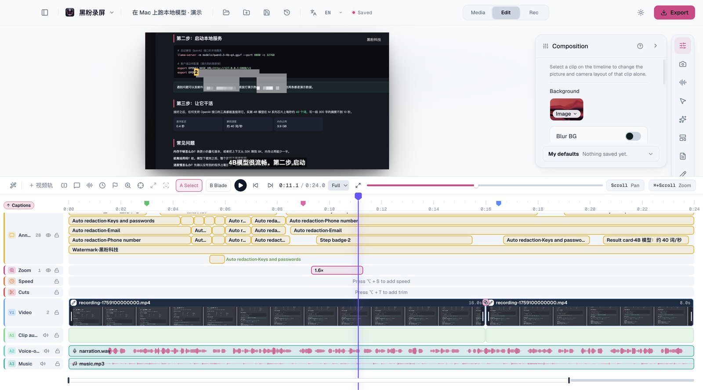
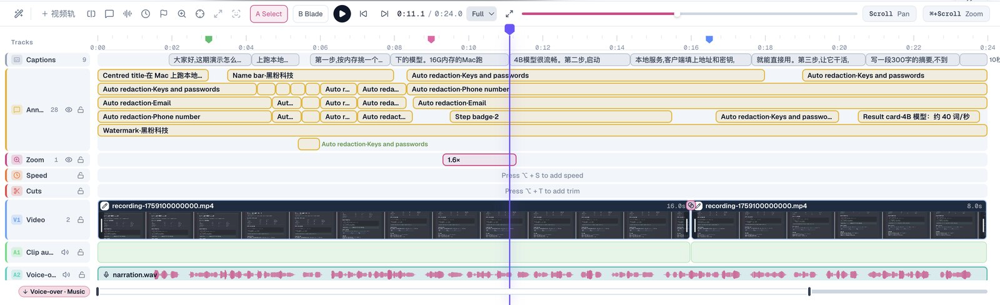
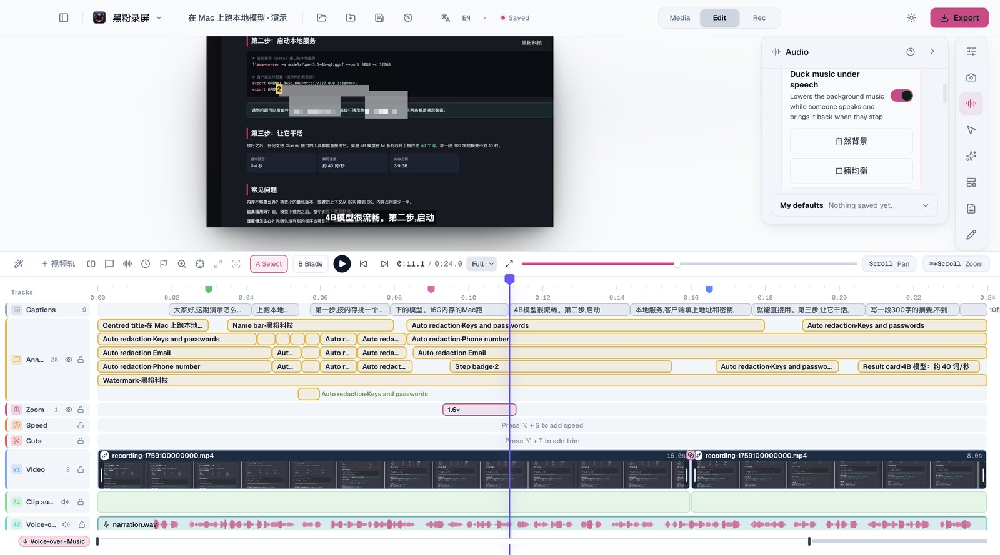
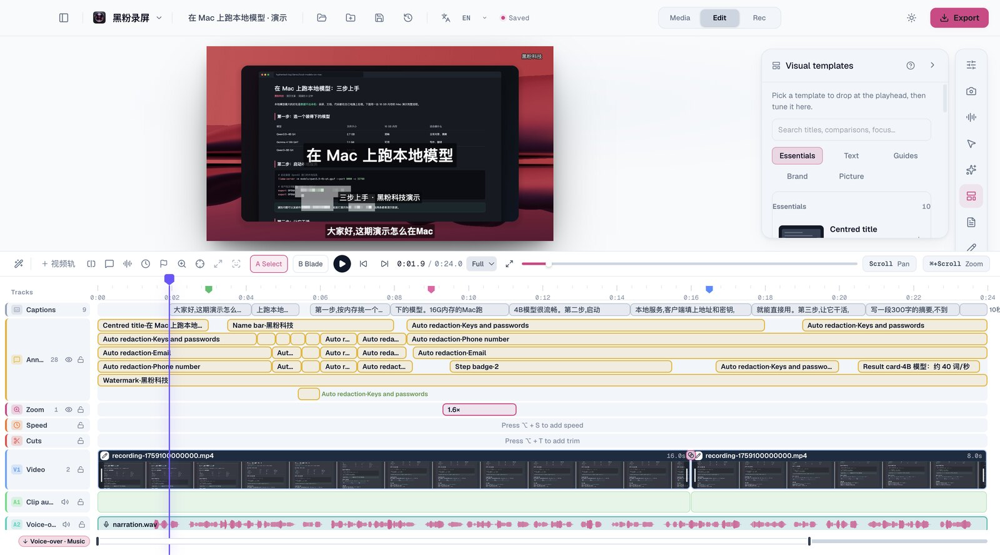
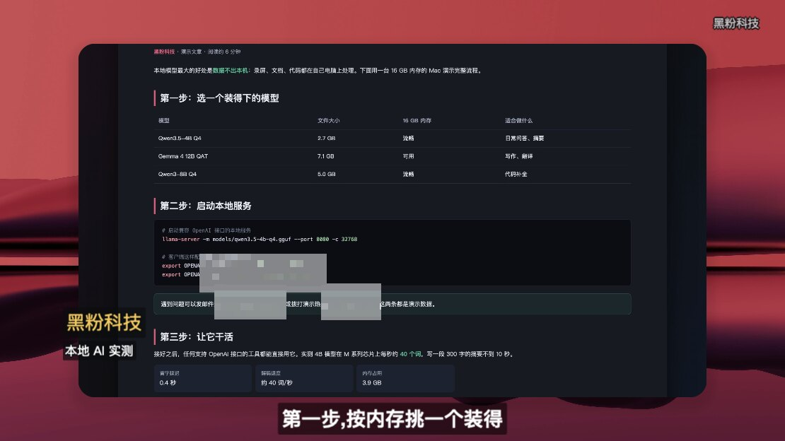
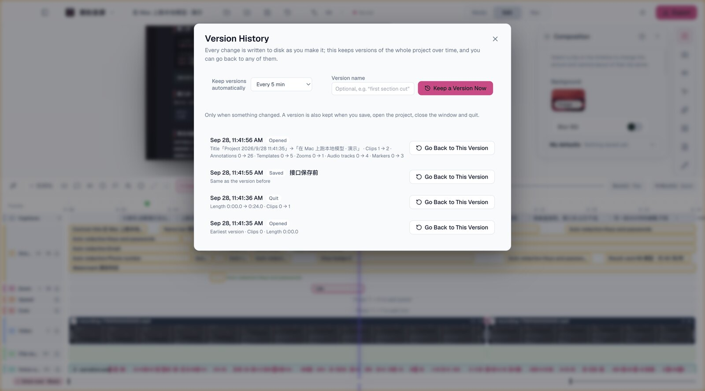
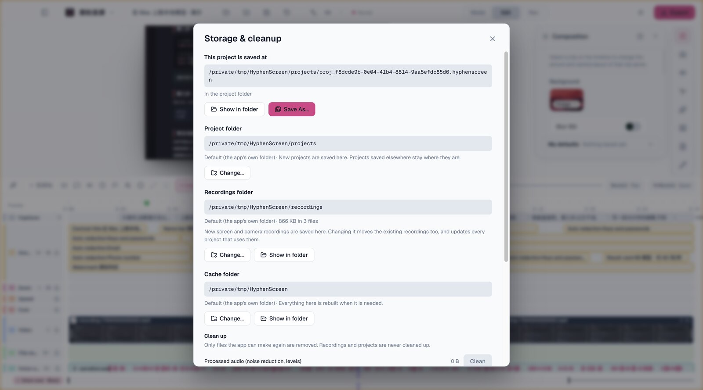
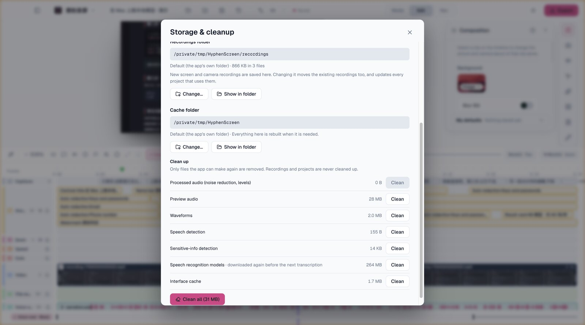

<!-- repair-20261003:start -->
> **Recommended download: HyphenScreen 1.0.9 — October 3 repair build**
>
> Fixes preview playback after deleting long clips, AI chat display and sending state, and adds clearer subscription sign-in recovery. The application version remains 1.0.9. Existing users should download and install this repair build manually.
>
> [Downloads for macOS, Windows and Linux](https://github.com/HackerChi-Hub/HyphenScreen-Releases/releases/tag/v1.0.9-fix-20261003). Previous installers remain unchanged.
<!-- repair-20261003:end -->

# HyphenScreen

## Empty timeline after recording, fixed in 1.0.8

- When a recording stopped and the editor opened, the timeline sometimes showed no media until you switched to Rec and back to Edit: the saves that build the new project could overwrite the first clip just placed on it. Those saves now run one after another, so the clip stays. The recording profile's camera look, which the same problem could leave unapplied, is fixed too.

## Self-media card and grouped animations in 1.0.7

One self-media card now covers 17 platforms — 10 Chinese (Douyin, Kuaishou, Bilibili, Xiaohongshu, WeChat Channels, WeChat Official Accounts, WeChat, Weibo, Zhihu, Toutiao) and 7 international (YouTube, TikTok, Instagram, X, Facebook, LinkedIn, Twitch), each with its own mark and colors. Switch the platform inside the animation panel; your edited account name, title and body text stay. Animations of the same type that differ only in style are now one library card (23 groups) with a style switch in the panel; searching for one style finds its card, and AI tools can switch styles too. The reference library grows to 368 migration previews, and each of the 42 new ones passed a frame-by-frame comparison with its original. Names and on-screen text use mainland Chinese wording. Fixes include sampled content arriving one frame late, bold Chinese rendering thin, and rotated text drifting.

## Existing animation snapshot in 1.0.6

This release retains 23 built-in presets and 326 Simplified Chinese migration previews. New migration batches are paused while existing effects are reviewed during real use. Single-line text edits adapt their width, and AI tools can change text, font size and color. Numeric bindings and native text rendering have improved; full reference parity and complex effects remain unfinished.

## Timeline improvements in 1.0.5

Empty tracks are hidden automatically and return when media is added. Tracks containing muted or disabled content remain accessible. An expandable Visual group combines annotations, overlays, and animations while keeping each object independently editable. Select them together, delete in one operation, and restore with one undo. Animation clips offer duration, speed, play-once, hold, and loop controls, with continuous source time after splitting.

## Native animation

An independent animation track generates its own frames without a background video. Edit text, shapes, charts, layers and keyframes, or use AI scene-data tools. The library includes 16 built-in presets, a self-media card covering 17 Chinese and international platforms, and 368 Simplified Chinese migration previews grouped into 23 families with an in-animation style switch. All 368 previews passed save/reload, native export and complete decoding. Full source-parameter and visual parity remains unfinished: these are migration previews, not 607 completed clones. See the download table on the release page for the currently available version of each platform.

[简体中文](README.md) · [繁體中文](README.zh-TW.md) · **English** · [日本語](README.ja.md)

**Record your screen, edit your story, and finish in one desktop app.** HyphenScreen by HyphenTech records your screen, camera and sound in one take, then lets you edit, caption and polish in the same window and export landscape or vertical video. It is built for software tutorials, tool demos and narrated explainers — videos you edit as soon as you have recorded them and publish as soon as they are edited.

## Download

[Installers and release notes](https://github.com/HackerChi-Hub/HyphenScreen-Releases/releases) · [Current version of each platform, with checksums](README.md#下载)

1.0.1 is the first official release. The download table is the authority for each platform's current version; a platform on an older version does not include the features added since. Installers are free and public; the product's source repository is private.

## Highlights

- **Recording without fuss** — full screen, a single window or any region, with camera, microphone and system sound in the same take. The pointer is recorded too, and zoom-ins are suggested where it lingers.
- **Multitrack editing** — import videos and audio in bulk, stack video tracks without a fixed limit, and arrange and trim by dragging. Captions, annotations, zooms and sound each have a clear track.
- **Captions that read well in Chinese** — on-device transcription, and captions that break lines between words, never inside a word or a model name.
- **AI that edits for you** — the built-in chat works with a Codex subscription or a local model, and external AI can drive the same editing tools through MCP.
- **Checked before you publish** — after export, a finished-video check covers loudness, silence and black frames, frozen pictures and overflowing captions, and reads the picture back to confirm no e-mail, phone number or key is visible. Automatic redaction stays on through zooms, crops, scrolling pages and vertical reframes.
- **Your files, your folders** — projects, recordings and caches each go where you choose (an external drive, for instance); existing recordings move along with every reference updated, and each kind of cache can be cleared on its own.
- **Local first** — recording, projects, transcription and redaction happen on your computer. There is no account; anonymous usage counting can be switched off in one click.

## What it is for

- Software tutorials, programming and tool demos, product walkthroughs
- Talking-head lessons with a camera, course and live-stream edits
- Turning a stretch of a landscape recording into a 9:16 short

## Feature tour

The screenshots are of the app itself. The demo project uses purpose-made media — a recording of a scrolling web page with synthetic narration and music, where every e-mail, phone number and key is fake. The two camera screenshots show the presenter's own camera. The recording, camera, multitrack, transition and AI chat screenshots show the Chinese interface; the rest show the English one.

### At a glance

Preview, inspector and timeline share one window. The moment above uses a zoom-in suggested from where the pointer lingered, a step badge pinned to the footage, on-device captions, automatic redaction and a corner watermark; the timeline also shows three markers and a dissolve between two clips.

### Recording

- Full screen, a single window or any region (optionally locked to 16:9, 9:16, 1:1 or 4:3); on macOS a click on a window takes its bounds. Region capture works on macOS and Windows.
- Camera, microphone and system sound record together with the pointer track, which later drives auto zoom and cursor effects. The camera records at the best quality the device offers, and the preview shows exactly that mode.
- Microphone, camera, capture area and camera look can be saved as named setups, switched in one click, with one of them used at launch.

### Timeline

- Tracks laid out the DaVinci Resolve way: captions, annotations, zoom, speed, cuts, V1 video (more video tracks above it), A1 original sound, then voiceover and music. Track headers show each track's name and item count and can lock, hide, mute and reorder.
- Items say what they are: the annotation text, the template, the redaction category, the zoom factor, the length cut, the caption sentence. Overlapping items move to their own rows.
- Clips carry a name bar and thumbnails; the original sound sits on its own track, linked to the picture. Voiceover and music waveforms are drawn for the part you can actually see, at device-pixel detail, so zooming in makes them sharper.
- Press M for a marker: name it, colour it, and copy the markers as chapter timestamps for a video description.
- The shortcuts you expect: A/B for select and blade, Cmd+B to split, J/K/L to play, I/O for in and out points, arrow keys frame by frame, undo and redo.

### Multitrack and on-canvas editing

- Import several videos and audio files at once. Video tracks have no fixed limit: the upper visible picture covers the lower ones, and all sound is mixed. Drag clips and their edges to arrange and trim; Shift for fine control, arrow keys frame by frame.
- While paused, select things right in the preview: move and scale the recording and the camera, move a split and drag its divider, and drag or resize captions, text, images, arrows, blur boxes and templates.
- Fullscreen preview (F in, Esc out). Preview resolution can drop to 3/4, 1/2, 1/3 or 1/4 to keep a heavy project smooth; exports always use full resolution.

### Screen and camera

- Picture-in-picture, side-by-side or stacked split screen, with one click to swap which side the camera is on. The screen always keeps its aspect ratio; the background can be an image, a colour, a gradient or a blur.
- Camera cut-out, background blur or a background of your own. The cut-out edge follows the real outline in the camera picture — fingers, glasses and shoulders stay crisp (macOS). The blur covers only the background, the same in preview and export.
- In picture-in-picture the screen and camera make room for each other: when the screen zooms, the camera shrinks into its corner; when the camera zooms, the screen shrinks and moves aside. A shrunken camera is sampled over each pixel's footprint, so it neither flickers nor blurs.
- "Camera only" shows just the camera for a stretch; "camera zoom" enlarges it. Both can ease in and out or cut hard. Camera borders include a solid frame and a travelling gradient pulse.

- Every clip can have its own layout and look: background, shadow, corners, padding, motion blur, camera layout and position, camera background and mirroring, cursor, original volume. Whatever a clip does not set follows the whole video.

### Captions

- On-device transcription creates captions (built-in Whisper, or LocalBrain), keeping the recognizer's real timestamps. Non-speech markers such as silence or music never become captions.
- Edit captions by hand, search and jump, restore the original wording, pick one of six styles, and adjust size, colour, plate, position and words per line.
- Chinese captions break between words, keep numbers and model names whole and balance the lines — and preview and export break in the same place.

### Sound

- Voice isolation (macOS): an on-device neural network removes keyboard, fan and other noise and keeps the voice, with low cut, EQ, compression, limiting and presets.
- Music ducking: the music dips while someone speaks and comes back after. Choose natural background, balanced voice or voice first, or set the lead-in, hold and release yourself.
- Split the original sound onto its own track, blade it, trim its edges and set each part's level (−60 to +36 dB); voiceover and music tracks each choose their own processing.
- Splitting a clip splits the voiceover and music laid over it too, and they play straight on across the cut.

### Visual templates and picture effects

- 35 templates in five groups — common, titles, guides, brand and outro, picture effects — with search across all of them: title cards, name strips, step badges, key caps, spotlight, result and comparison cards, outro with a call to action, corner watermark and more.
- 13 text styles and 11 picture effects recreated from HyphenCut, such as editorial chapter titles, bold impact titles and handwritten quotes; warm documentary, teal-and-orange, vignette, RGB glitch, rectangle mask and a dark evidence plate. Every setting can be changed, and everything can fade in and out.
- Templates sit on the annotation track and move, split and disappear with their clip. Nine fonts ship with the app, so text looks right even where they are not installed.

### Transitions

- 12 transitions — dissolve, dip to black, dip to white, wipes and pushes in four directions, and zoom — with the sound fading along. Set them cut by cut or apply one to every cut at once.

### Automatic redaction

- On-device text recognition finds e-mail addresses, phone numbers, ID numbers, bank card numbers, keys and your own keywords, and covers them with a mosaic or a blur (automatic detection is macOS-only for now; manual blur boxes work everywhere). ID and card numbers are checksum-verified, so there are few false alarms.
- Redaction follows zooms, tilts, crops and vertical reframes. On a scrolling page the boxes follow the text stretch by stretch, covering only where it travels — never half of the frame.
- Every box starts before the text appears and ends after it is gone, so no frame shows it readable.

### Finished-video check

- After export, check the finished file itself: loudness and true peak (with a suggested output level), stretches of silence and black, frozen pictures, a video shorter than its timeline, and captions or titles that do not fit. Text recognition reads the picture back to confirm nothing sensitive shows (macOS for now).
- Mark every finding on the timeline in one click and step through them with Shift+↓.

### Vertical highlights

- Turn a stretch of a landscape recording into a 9:16 short: software is cropped around the pointer, web pages and documents are kept whole, with the title above and captions below, and zooms stay inside the picture area.

### AI editing

- The built-in chat works with a Codex or Claude subscription (reusing the official login on this computer, no key to paste), a local model in LocalBrain, or another model service with your own key. 88 tools cover editing, sound, captions, transitions, redaction, zoom, markers, per-clip effects, visual templates, native animations, inserted video, vertical highlights, export and the finished-video check — everything you can do by hand in the editor.
- 12 one-click recipes: tighten a talk, shorten pauses, remove filler words, remove repeats and retakes, make a vertical highlight, check before publishing, and more.
- External AI can use the same tools through MCP (92 with reading, saving, undo and redo).

### Projects, history and storage

- Every edit is written to disk at once. On top of that, versions of the whole project are kept over time (every 5 minutes by default, only when something changed), each labelled with its cause and changes; go back to any of them, and undo the going back.
- Save a project anywhere, open one from anywhere, or export an independent copy; the folder new projects go to can be an external drive.

- **Storage & cleanup**: move the recordings folder somewhere else and **the existing recordings move with it**, with every project and saved version pointed at the new place. Everything is copied and checked before an original is deleted; a take that has just stopped is never moved half-written; moved files keep their dates.
- Move the cache folder too: the old caches are simply deleted and rebuilt in the new place as needed. When a chosen drive is not connected, new files go to the default folder for the time being, and the dialog says so.

- Cleanup lists processed audio, preview audio, waveforms, speech detection, redaction detection, speech models and the interface cache with their sizes; clear any one of them, or all at once (speech models excepted). Recordings and projects are never touched.

### Closing and quitting

- The window's close button only hides the app; it keeps running in the tray (the menu bar on macOS), one click away. Choose Quit Completely in the tray menu to quit.
- Before quitting, the open project is written to disk and read back to check it; background work the app started — voice isolation, transcription, encoding — ends with it.

## Requirements and privacy

- **macOS:** 13 or later, Apple silicon. Locally signed, not Apple-notarized.
- **Windows:** Windows 10/11 x64 with D3D11 hardware video decoding. The installer is unsigned.
- **Linux:** x86_64, glibc 2.35 or later (Ubuntu 22.04, Debian 12 or newer), Vulkan, and `xdg-desktop-portal` with your desktop's backend. AppImage needs FUSE 2.
- Recording, editing and export run locally. Only when you use the AI chat do the conversation and the relevant project text go to the provider you choose. Anonymous usage counting (a daily device count, nothing about your content) can be switched off in the app menu.
- Required third-party license notices ship inside the application.

## FAQ

- **Do I have to pay or sign up?** No. Download and use it; there is no account.
- **My system says the app is from an unidentified developer.** The installers are not notarized or code-signed yet; allow the app as described in the release notes. Every installer's SHA-256 is listed in the download table.
- **Is my recording uploaded?** No. Recording, editing, transcription and export happen on your computer.
- **How do I update?** "Check for Updates" in the HyphenScreen menu tells you whether a new version is out (it does not download or install anything). Install the new version over the old one; the release notes say what changed.

© 2026 HyphenTech. HyphenScreen.
