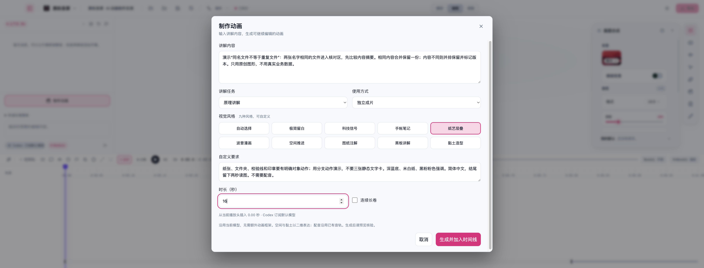

<!-- evergreen:intro:start -->

# HyphenScreen · 画面録画、編集、ネイティブアニメーション

**必要な操作だけ録画して、残りは画像、アニメーション、ナレーションで仕上げる。**

HyphenTech のデスクトップ録画・編集ソフトです。ソフトウェア解説、製品デモ、ナレーション動画を、録画からマルチトラック編集、字幕、音声処理、アニメーション、書き出しまで一つのウィンドウで制作できます。AI に自然言語で編集を依頼することもできます。

[最新版をダウンロード](https://github.com/HackerChi-Hub/HyphenScreen-Releases/releases/latest) · [問題を報告](https://github.com/HackerChi-Hub/HyphenScreen-Releases/issues)

<a href="README.md">简体中文</a> | <a href="README.zh-TW.md">繁體中文</a> | <a href="README.en.md">English</a> | <a href="README.ja.md">日本語</a>

 

<!-- evergreen:intro:end -->

<!-- recent-features:start -->
## 最近の機能追加と改善（5件）

- **1.5.0** · AI の制作画面で内容、用途、二次元表現、長さと連続する場面を指定できます。
- **1.5.0** · タイムラインの画面順序を統一し、上が下を覆います。見出しの並べ替え、名前変更、非表示、ロックに対応。
- **1.5.0** · 方寸智匣のモデル自動検出と実際の会話・ツール呼び出しテスト。
- **1.5.0** · 会話ごとの内容と実行状態を分離し、旧タスク中も新会話を使えます。会話量の推定を表示。
- **1.5.0** · 工程の新規作成と切替で再生位置を先頭に戻し、冒頭の空白を防ぎます。
<!-- recent-features:end -->

<!-- development-timeline:start -->
### 1.5.0：わかりやすいタイムライン

画面、調整、音声を分け、字幕、画像、アニメーション、注釈、動画に共通の上下順序を使います。上の画面が下を覆います。見出しのドラッグや右クリックで並べ替え、名前変更、非表示、ロック、幅の調整ができます。工程全体に素材のないトラックは非表示になり、音声は独立してミックスします。工程切替は先頭に戻り、同じ工程の更新では再生位置を保持します。
<!-- development-timeline:end -->

<!-- development-animation-authoring:start -->
### 1.5.0：解説から編集可能なアニメーションを制作

AI パネルの制作画面で内容と独自の要望、用途、九つの二次元表現、長さ、配置、連続する場面を指定します。モデルが物体と動きを設計し、編集可能なレイヤー、キーフレームとクリップを書き込みます。無音の独立作品、透明な重ね合わせ、全画面挿入に下敷きの動画は不要です。

方寸智匣は読み込み済みの言語モデルを自動検出します。Qwen3.8 27B の実測で自由場面の生成、ツール書き込み、工程の再読込とネイティブ書き出しを確認しました。八秒の紙表現による重複整理は生成に約六分四秒かかりました。単一の実測で、速度保証ではありません。サブスクリプションモデルでも荷物仕分け、重複整理、二次元の連続水循環を生成し書き出しました。九つの方向は全題材で参考品質の紙、絵画、三次元を保証しません。参考部品の動画は比較基準であり、ソフト内の生成結果ではありません。

接続とツール呼び出しのテストは、現在のモデルと接続先で実際の往復を調べ、工程やテスト設定を保存しません。キー設定済みは認証成功ではありません。MiniMax 候補の自動課金テストはありません。会話の内容と実行状態を分離し、ローカル二会話とサブスクリプションの並行切替を確認しました。コンテキスト表示は会話文字の推定で、モデル全体の使用量ではありません。
<!-- development-animation-authoring:end -->

<!-- evergreen:demos:start -->
## ▶ 使い方の動画

**録画設定、カーソルズーム、アニメーション、AI 音声編集**

| Bilibili | YouTube |
| :---: | :---: |
|  |  |

動画は撮影時のバージョンです。現在の機能と配布パッケージはこのページのリリース情報をご確認ください。動画の解説は中国語です。
<!-- evergreen:demos:end -->

## ダウンロード: 1.5.0

| プラットフォーム | パッケージ | SHA-256 |
|---|---|---|
| macOS 13+（Apple 芯片 arm64） | [ダウンロード HyphenScreen_1.5.0_arm64.dmg](https://github.com/HackerChi-Hub/HyphenScreen-Releases/releases/download/v1.5.0/HyphenScreen_1.5.0_arm64.dmg) | `a903e83ba5187d6563df1dcdd39dbb8fd53a1a86f728cec09bb2c616c196404f` |
| Windows 10/11（x64）· 1.4.9 版 | `HyphenScreen_1.4.9_x64-setup.exe` | `2a5360174326f302e64fc376a519d21147b5b53758a48d6726a9a23c83f12210` |
| Linux（x86_64）· 1.4.9 版 | `HyphenScreen_1.4.9_x86_64.AppImage` | `70806d48b0afa4c79ee67d26a004aba44181739e62eaf996759bf55b45c6b57f` |
| Debian / Ubuntu（amd64）· 1.4.9 版 | `HyphenScreen_1.4.9_amd64.deb` | `4c53fc9acc7a7220515b78062d6c6e731970eb64119e8af259103fe3578bb1dd` |
| Arch Linux（x86_64）· 1.4.9 版 | `HyphenScreen_1.4.9_x64.pacman` | `4887634f0c4ffba890a67251a9ab7991877b4f26c9192097c1c1c51998100930` |

<!-- evergreen:capabilities:start -->

## 制作の流れ

| 工程 | 主な機能 |
|---|---|
| 録画 | 画面・ウィンドウ・範囲、カメラ、マイク、システム音声、録画プロファイル、ポインター軌跡 |
| 編集 | 動画・音声の一括読み込み、複数動画トラック、上位映像の合成と音声ミックス |
| 画面 | 比率を保つフレーム、ピクチャーインピクチャー、上下・左右分割、カメラ全画面と境界効果 |
| 字幕 | ローカル文字起こし、手動修正、検索、スタイル、色、背景、中国語の改行 |
| 音声 | 独立トリミング、クリップ音量、EQ、コンプレッサー、リミッター、BGM ダッキング |
| 動き | 独立シーン、レイヤー、キーフレーム、イージング、長さ、速度、再生モード |
| AI | サブスクリプション、ローカルモデル、API、編集テンプレート、MCP ツール |
| 出力 | MP4・GIF、横長・縦長、解像度・フレームレート・コーデック、マスクと出力検査 |

## 動画を敷かずにアニメーションを作る

アニメーションクリップは背景を含めて自分で画面を生成します。録画した冒頭、図表、画像、動画素材、読み込んだ TTS 音声を組み合わせて一本の動画にできます。文字、画像、図形、ベクター、図表、矢印をレイヤーとして編集し、順序、グループ、複数選択、非表示、ロックを操作します。位置、サイズ、不透明度、回転、色、対応する数値にキーフレームとイージングを設定できます。

プレビューと書き出しは Rust 合成器のシーン処理を共有します。AI は JSON シーンデータを変更し、Remotion コードの実行環境を追加する必要はありません。画面でドラッグするか数値を入力して調整。開始時間、長さ、速度、一回再生、ループ、最終フレーム保持、静止表示を設定できます。

## 用途別の素材ライブラリ

共通、文字・タイトル、データ・図表、解説、ブランド・エンディング、SNS、画面効果、ハードウェア、AI の仕組み、フロー・構成図に整理されています。現在は同種スタイルをまとめた **333 枚の入口カード**。解説は **108 枚**を指示、手順、比較、場面説明で絞り込めます。23 の引用・主張例は一つの文字タイトル系列に統合。短い用途名は折り返し表示でき、元の名前でも検索できます。

一般的な内蔵アニメーションは 16 種類、SNS カードは 17 プラットフォームに対応。参考移行プレビューは 368 項目、さらに LottieFiles の無料アニメーションから変換したネイティブアニメーション 300 項目で、類似スタイルを同じカードから選択します。移行プレビューには元パラメーターの完全な再計算、複雑なフィルター、動的な見た目の一致で未完成部分があり、全参考例の完全な複製ではありません。

SNS カードは抖音、快手、Bilibili、小紅書、WeChat Channels、WeChat Official Accounts、WeChat、Weibo、知乎、今日頭条、および YouTube、TikTok、Instagram、X、Facebook、LinkedIn、Twitch に対応。切り替えても編集済みのアカウント名、タイトル、本文を保持します。

## タイムライン、カメラ、音声

動画トラックに固定の上限はなく、上位の可視映像を優先し、音声はミックスします。分割、移動、端のドラッグによるトリミング・復元、マーカー、トランジション、分類した右クリックメニューを利用できます。注釈・オーバーレイ・アニメーションは展開できるビジュアルグループに配置。範囲選択、まとめて削除、一回の取り消しに対応し、空トラックは自動で隠れます。

プレビュー上で画面、カメラ、字幕、対応する注釈を直接移動・拡縮できます。録画後のズームはポインターの停止位置から提案し、画面の縦横比を保ちます。カメラは小窓、左右・上下分割、複数クリップをまたぐ全画面区間に対応。全画面への入り方はハードカットか滑らかな遷移を選べます。枠の太さ、色、グラデーションパルスを調整できます。カメラ背景のぼかし、除去、置換は現在 macOS のみです。

字幕は手動修正、検索、元テキスト復元、スタイル変更が可能。音声は独立して切り、元音声を分離し、クリップ音量を -60〜+36 dB で調整できます。BGM ダッキングは自然な背景、ナレーションとのバランス、ナレーション優先のプリセットを備え、先行量、保持、復帰時間も調整可能。音声分離は現在 macOS のみ。波形は表示区間を細かく描き、分割後も元の時間に沿って表示します。

## 自分の AI を接続

Codex・Claude は公式ローカルクライアントとログイン状態を検出し、失敗時には目立つログイン・再認証案内を表示します。Codex にログイン用のフォールバックを用意。LocalBrain はローカルサービスを発見して優先言語モデルへ必要時に接続します。利用可否は実際のサービス状態と応答に従い、全モデルを検証済みという意味ではありません。

API は OpenAI、Claude、Gemini、Mistral、OpenRouter、MiniMax、MiniMax Token Plan、OpenAI 互換に対応。MiniMax の中国国内・国際エンドポイントは分けて設定します。テンプレートにはナレーション整理、間の短縮、言いよどみ・重複削除、音声処理、BGM ダッキング、ズーム、マスク、縦長化、出力検査があります。現在 MCP は **92 ツール**を公開し、実装済みのプロジェクト、字幕、音声、タイムライン、アニメーション、書き出しを操作します。AI の編集結果はプレビューで確認してください。

## 書き出し、保護、プロジェクト管理

MP4・GIF、解像度、フレームレート、H.264・H.265 を選択。「拡大」は元サイズを超えるリサイズを示し、元映像にない細部を復元するものではありません。横長動画の見どころを 9:16 に編集できます。出力検査は音量、無音、黒画面、停止フレーム、長さ、文字の境界を確認。自動機密文字検出と出力 OCR 検査は現在 macOS のみ、手動マスクは各プラットフォームで使えます。

プロジェクト、録画、キャッシュの保存先を外付けドライブなどに分けられます。キャッシュを種類別に整理し、自動・名前付きの履歴からプロジェクトを戻せます。

## ダウンロードと対応範囲

無料でダウンロードでき、HyphenScreen アカウントは不要です。AI の契約・API は自分のアカウント、キー、利用枠を使います。録画とプロジェクトはローカルに保存。クラウド AI にはその要求に必要な会話とプロジェクト情報を送ります。ローカル推論はコンピューター内に保持できます。匿名の端末カウントは無効化可能です。

- **macOS：** 13 以上、Apple Silicon。DMG はローカル署名済み、Apple 公証なし。
- **Windows：** 10・11 x64、D3D11 動画デコード。インストーラーはコード署名なし。
- **Linux：** x86_64、glibc 2.35 以上、Vulkan とデスクトップポータル。AppImage・deb・pacman。

インストール手順と SHA-256 は[ダウンロードページ](https://github.com/HackerChi-Hub/HyphenScreen-Releases)をご覧ください。Mac 1.4.9 は427個のファイルとリンクがイメージに一致し、ローカル署名も有効です。インストール版でアニメーションライブラリ、レイヤー編集と再生を確認し、カメラ切替時のネイティブ画素テストも通過しました。公開5パッケージを再ダウンロードし、SHA-256がすべて一致しました。全体テストは4403件成功、2件スキップ（ソフトに含めない私的な外部制作テスト5件を含む）。録画、物理カメラ、顔修復、オンライン生成の全手順は再検証していません。Windows・Linuxのデスクトップ検証は未完了です。既存画像はMac 1.1.0デモの中国語UIです。私的テスト画像は公開しません。

Copyright © 2026 HyphenTech。必要な第三者ライセンスと原著作権表示はアプリに同梱。公開リポジトリは配布物と説明を提供し、ソースは非公開です。
<!-- evergreen:capabilities:end -->

<!-- evergreen:discovery:start -->
## HyphenTech のソフトウェア

[LocalBrain](https://github.com/HackerChi-Hub/localbrain-releases) · [HyphenScreen](https://github.com/HackerChi-Hub/HyphenScreen-Releases) · [ScreenLex](https://github.com/HackerChi-Hub/screenlex-download) · [HyphenBox](https://github.com/HackerChi-Hub/hyphenbox-release)
<!-- evergreen:discovery:end -->
