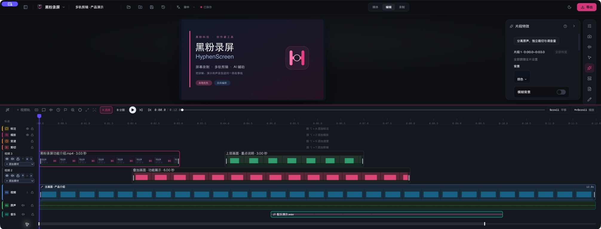
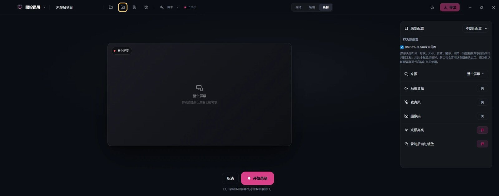
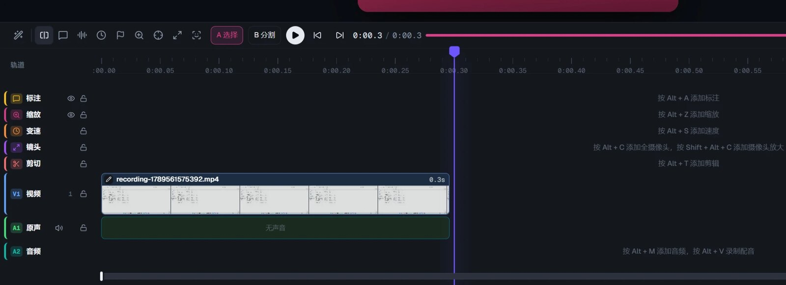
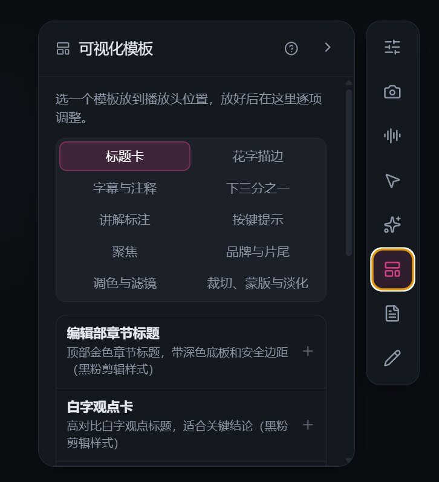
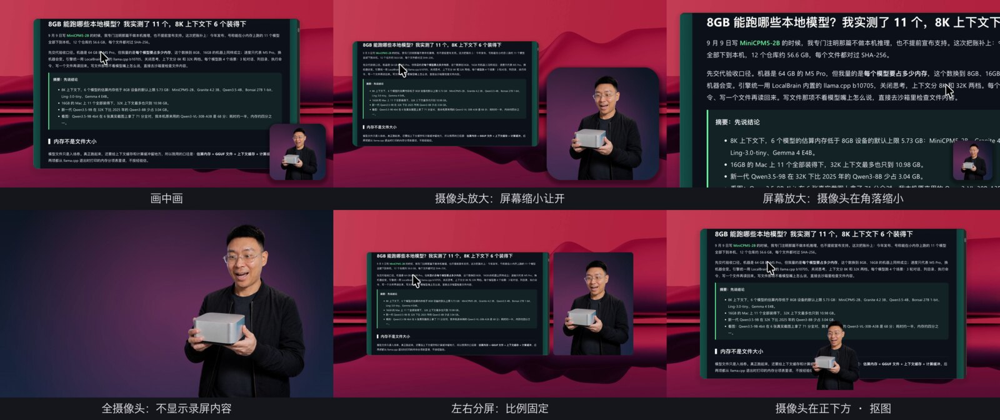
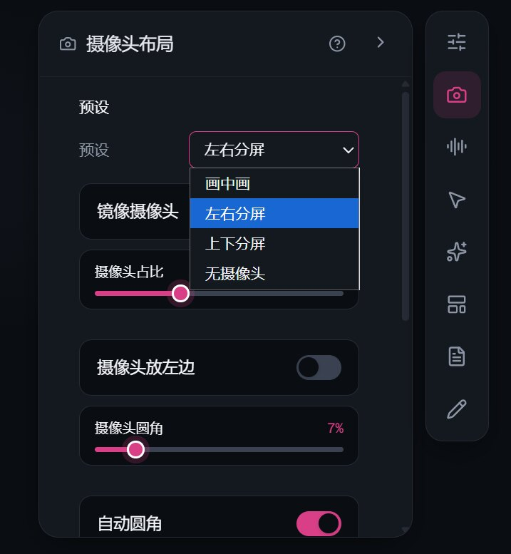
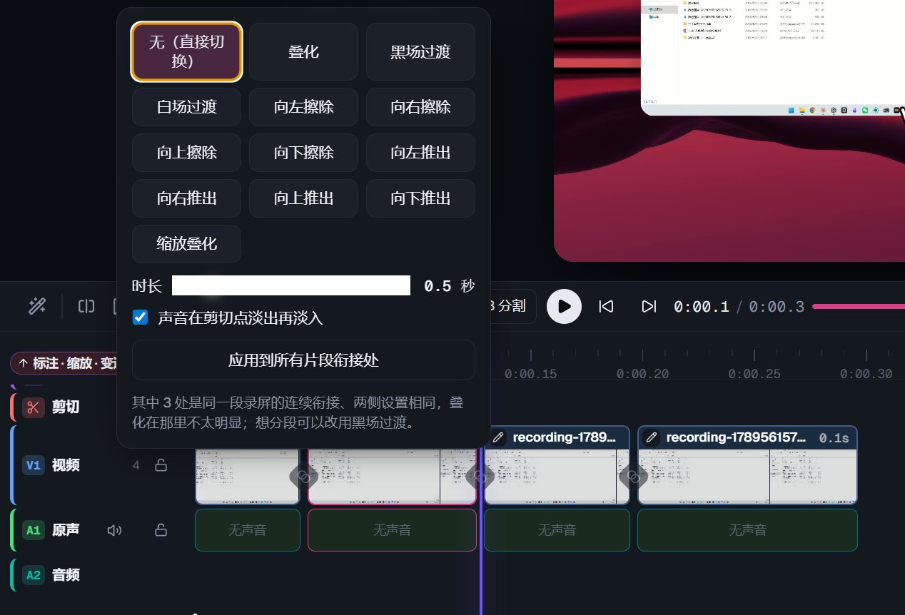
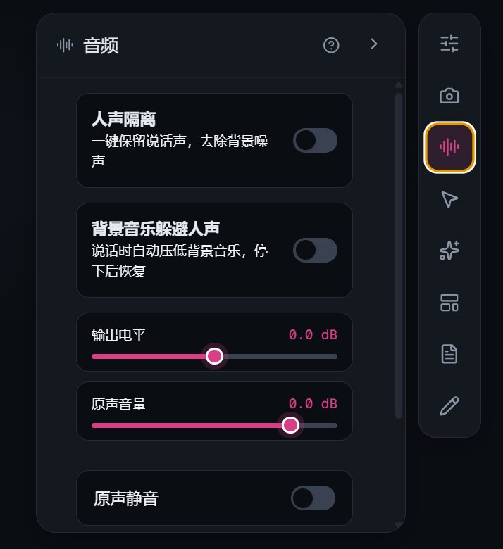
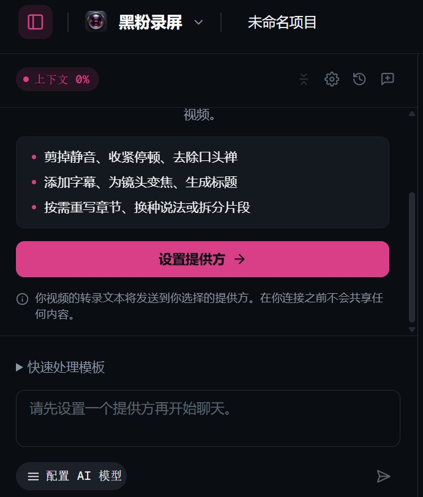

# 黑粉录屏 HyphenScreen · 下载

黑粉科技的桌面录屏与智能剪辑软件。本仓库只存放安装包、校验和与发行说明；源码在独立的私有仓库。

**当前版本：[黑粉录屏 0.4.42 · 预览版](https://github.com/HackerChi-Hub/HyphenScreen-Releases/releases/tag/v0.4.42)**（预览版：功能可用，仍在实测中；每个平台只保留最新的一版）。

> 0.4.42 目前提供 macOS 安装包；Windows 继续提供 [黑粉录屏 0.4.36 · 预览版](https://github.com/HackerChi-Hub/HyphenScreen-Releases/releases/tag/v0.4.36)，尚未发布 0.4.42 的 Windows 版；Linux 继续提供 [黑粉录屏 0.4.36 · 预览版](https://github.com/HackerChi-Hub/HyphenScreen-Releases/releases/tag/v0.4.36)，尚未发布 0.4.42 的 Linux 版。

## 软件介绍

黑粉录屏是黑粉科技的桌面录屏与剪辑软件：把屏幕、摄像头和声音一次录好，在同一个窗口里剪辑、加字幕和效果，导出横屏或竖屏成片。专门为软件教程、工具演示和口播讲解这类「录完就要剪、剪完就要发」的视频打磨。

**语言介绍：** 简体中文 · [繁體中文](README.zh-TW.md) · [English](README.en.md) · [日本語](README.ja.md)

### 亮点

- **录制省心**：整个屏幕、单个窗口或框选区域，摄像头、麦克风和系统声音一起录，鼠标轨迹同步记下，剪辑时按鼠标停留自动推荐平滑放大。
- **多素材、多视频轨剪辑**：批量导入视频与音频，视频轨道不设固定数量上限；上层覆盖画面、各层声音混合。拖动片段位置与左右边缘完成编排和裁切，字幕、标注、缩放与声音清楚分轨。
- **字幕与中文排版**：本机转写生成字幕，中文按词语换行，数字和英文型号不拆开，预览和导出断在同一处。
- **AI 帮你剪**：内置聊天可以用 Codex 订阅（复用本机登录）或本地模型，用一句话完成口播精剪、压缩停顿、去掉口头禅、横屏转竖屏精彩片段；外部 AI 也能通过 MCP 接口调用同一套剪辑工具。
- **发布前把关**：导出后「成片体检」检查响度、无声与黑屏、画面卡住、字幕越界，并回读画面确认邮箱、手机号、密钥等敏感信息有没有露出；自动打码在放大、裁剪和改成竖屏后依然盖住。
- **本地优先**：录制内容、工程文件、转写和打码识别都在你的电脑上处理，没有账号体系；匿名使用统计只做设备计数，一键可关。

### 适合做什么

- 软件操作教程、编程与工具演示、产品功能讲解
- 带摄像头的知识分享、课程与直播回放整理
- 把一段横屏录屏剪成 9:16 短视频，发到短视频平台

### 系统要求

| 平台 | 要求 |
|---|---|
| macOS | 13 及以上，Apple 芯片（M 系列） |
| Windows | Windows 10 / 11 64 位；显卡需支持 D3D11 硬件视频解码（预览与导出都用它） |
| Linux | x86_64，glibc 2.35 及以上（Ubuntu 22.04、Debian 12 及更新）；Vulkan 驱动；`xdg-desktop-portal` 及桌面对应后端 |

### 常见问题

- **要付费或注册吗？** 不用，下载即可使用，没有账号。
- **安装时系统说来源不明、不安全？** 预览版没有做苹果公证和 Windows 代码签名，按下方「安装」里的步骤放行即可；每个安装包的 SHA-256 都列在下载表里，可以自行核对。
- **我的录屏会被上传吗？** 不会。录制、剪辑、转写和导出都在本机完成。只有在你主动使用 AI 聊天时，对话和工程里的相关文字会发给你选择的模型服务（Codex 订阅或本地模型）。
- **怎么升级？** 应用内暂时没有自动更新。新版本发布到本页后，下载安装覆盖即可；工程文件是否兼容、有哪些变化，写在每一版的发行说明里。
- **旧版本在哪里下载？** 本页每个平台只保留最新的一版。

## 下载

到[发行页面](https://github.com/HackerChi-Hub/HyphenScreen-Releases/releases)按平台取包。

| 平台 | 文件 | SHA-256 |
|---|---|---|
| macOS 13+（Apple 芯片 arm64） | `HyphenScreen_0.4.42_arm64.dmg` | `272a093bbc3052a8c177fd94b43327ce18c688b34bebd6ad270f49fb8f050ea1` |
| Windows 10/11（x64）· 0.4.36 版 | `HyphenScreen_0.4.36_x64-setup.exe` | `3083ebe54d5971ae3ba3dc3570b13cf2308574872b19023d628b054f1bfbcad5` |
| Linux（x86_64）· 0.4.36 版 | `HyphenScreen_0.4.36_x86_64.AppImage` | `137ab42c10c7c7ef72e031bc7061d7bee7f7d21a652d45ba4c3d4652f519eb5b` |
| Debian / Ubuntu（amd64）· 0.4.36 版 | `HyphenScreen_0.4.36_amd64.deb` | `7adbf36462d12ad95f6982d2869f59505de3c22093ccf9af670a3408a4940b44` |
| Arch Linux（x86_64）· 0.4.36 版 | `HyphenScreen_0.4.36_x64.pacman` | `b81caf0ddcfd14b7cc9bf5bc16b89f1df65a1852e4df639e11ce57a58e13332f` |

同一页附带各平台的 `SHA256SUMS*.txt` 与 `release-manifest.json`，可核对文件完整性与构建来源。

> 下面的功能一览按 0.4.42 介绍；Windows 暂为 0.4.36，不包含之后加入的功能；Linux 暂为 0.4.36，不包含之后加入的功能，各版变化见发行页面上的发行说明。

## 功能一览

### 0.4.35 修复摄像头预览被放大（macOS）

- 0.4.34 为了「按设备最高清晰度采集」请求了一个比任何摄像头都大的尺寸，但浏览器是按宽、高各自打分再相加来挑模式的，竖屏模式因此可能胜出：MacBook Pro 摄像头实测选中 1080×1920 竖屏，在 16:9 的预览框里只剩中间约三分之一并被放大 1.78 倍。
- 现在挑模式时明确要求横向画面（比例下限 1.2、优先 16:9），同一台 Mac 改为选中 1920×1080；分辨率仍不锁死，像素更多的横向模式依旧可以胜出，只有竖屏模式的摄像头也仍能打开录制。
- 摄像头预览改为完整显示整帧（比例不一致时留黑边），不再裁掉一部分再放大；录制页预览右上角显示实际打开的模式，例如「1920×1080 · 30 fps」。

> 0.4.29 起的新功能（摄像头边框与硬切、高解析度波形、多轨剪辑、画布直接编辑、全屏预览与预览分辨率档位）三个平台同源。装机实测目前只在 macOS 上做过，Windows 与 Linux 版通过构建与自动检查。

### 0.4.33 预览与波形

- 全屏预览：按 F 或点播放条上的全屏按钮，画面占满整个窗口，顶栏、检查器、时间线全部让开；播放条悬浮在底部，停手两秒自动淡出，鼠标一动就回来，Esc 或再按 F 退出。
- 预览分辨率档位：完整、3/4、1/2、1/3、1/4。复杂工程放低档位播放更流畅，所有效果照常渲染，只是画面小一些；导出始终用完整分辨率，这个设置只记在本机，不写进工程。
- 时间线波形按屏幕上真正看得见的那一段、以设备像素为单位绘制：放大到 20 倍时屏上采样柱由 117 根增加到 1875 根，每根代表的时长从 256 毫秒细化到 16 毫秒，放得越大越清楚。
- 波形采样密度从每秒 1000 个提高到 2000 个（0.5 毫秒一格），三条求峰值的管线共用同一套分辨率参数，换算缓存自动失效重算。

### 0.4.32 多轨剪辑



- 一次选择多个视频和音频导入素材库，支持把列表中的素材加入时间线。
- 视频轨道不设置固定数量上限：上面的可见视频覆盖下面的画面，上层片段结束后恢复下层对应时刻的画面。视频原声、口播与背景音乐默认叠加混音。
- 点击「＋视频轨」新建轨道；可以重命名、上下调整顺序、隐藏画面、静音原声、锁定或删除。隐藏画面与静音是两个独立开关。
- 上层视频可拖动位置、跨上层轨道移动、分割、复制、删除，并独立设置片段效果。主轨仍提供连续排列的剪辑方式。
- 拖动视频片段左右边缘裁切或恢复素材；按住 Shift 精调，选中把手后用左右方向键逐帧调整。恢复范围以原始素材为界，不会凭空延长视频。
- 空白时间保留为空白画面；工程保留所有层的素材，保存重开后继续编辑。轨数没有固定上限，实际承载能力取决于设备、素材和效果复杂度。

### 界面可读性

- 转场的“无”选项简化文案；时长采用高对比轨道、粉色滑块和独立秒数框。

### 0.4.30 编辑更新

- 摄像头可“开头立即全屏、结束平滑还原”，进入和退出分别设置，原有平滑与硬切都保留。
- 摄像头边框改为高对比选项卡，清楚区分无边框、纯色框、环绕渐变脉冲。
- 原声与独立音频支持 -60 至 +36 dB；音乐避让增加自然背景、口播均衡、口播优先三种预设，以及提前压低、停顿保持与柔和恢复。
- 时间线右键按对象精简分组：切分、裁切、分离原声、复制、静音、删除与设置入口；空白处添加内容。
- 标注和视觉模板允许时间区间重叠，拖动后保持多个内容共存。

### 0.4.29 编辑更新

- 摄像头全屏跨片段，可关闭进出动画直接硬切；纯色框和环绕渐变脉冲支持粗细、颜色调整。
- 高解析度波形在切分后保持原始时间对齐；原声可分离、刀切、拖边裁切和逐段调音量。
- 字幕支持手动修改、搜索定位、恢复原文与六组样式；改变字号和画幅不丢修改。
- 画布选框留在预览区域，取消常驻调整工具条，转场和导出面板优先显示。
- 复用音频处理结果，后续均衡调整明显提速；首次人声隔离仍需要模型计算。

### 录制



- 整个屏幕、单个窗口，或框选任意区域（可锁定 16:9、9:16、1:1、4:3）；macOS 上单击窗口可直接取它的范围。框选目前支持 macOS 与 Windows。
- 摄像头与麦克风同步录制，鼠标轨迹一起记录，供自动放大和光标效果使用。
- 摄像头按设备支持的最高清晰度录制（0.4.34）：1080p 摄像头录 1080p，不再固定在 720p；录制前的预览与录制取同一档，所见即所录。
- 麦克风、摄像头、录制范围和摄像头的全部外观可以存成多套录制配置，一键切换，并指定启动时默认使用的一套。
- macOS 0.4.28 修复大疆 MIC MINI 的 24 位麦克风音频无声，以及选择内置麦克风时因设备名称后缀无法匹配、回退默认输入的问题；两种设备均已通过安装版短录制与导出验证。

### 项目保存

- 每次修改立即写入磁盘，并定时记录整个项目的版本，可以退回任意一个；退出前确认项目已完整保存，点关闭时软件留在托盘。
- 项目可以另存到任意位置，之后就保存在那里；也可以从任意位置直接打开项目文件，或导出一份独立副本。
- 新建项目的默认文件夹可以改成任意位置（比如外接硬盘），已有项目可以一起移过去，也可以留在原处继续使用。

### 剪辑时间线



- 字幕、标注、缩放、变速、剪切与声音各有清楚的轨道；V1 主轨上方可继续添加视频轨道，轨道头写明名称并提供显示、静音、锁定与排序按钮。
- 条目直接写出内容：标注文字、打码类别、放大倍数、剪掉的时长、字幕句子；重叠的条目自动分行。
- 视频片段带名称条和缩略图，原声单独成轨并与画面联动，可单独静音和调音量。
- 轨道可以锁定防止误改，标注与缩放轨道可以临时关闭（打码始终保留）；按 M 打标记点，可命名、换颜色，标记跟着画面走。
- 熟悉的操作：A/B 选择与刀片、Cmd+B 分割、J/K/L 播放、I/O 入出点、撤销与重做。

### 画布直接编辑

- 暂停预览，直接点选对象：录屏画面与摄像头可移动、等比缩放，修改当前片段；左右或上下分屏可整体移动、缩放，拖动中线调摄像头占比。
- 字幕可直接拖动全片位置；文字、图片、箭头与模糊标注可点选、移动和调整尺寸；模板可整体移动、等比缩放，聚焦框与矩形蒙版可直接调整范围。
- 选中对象在预览区域内置顶，方向键微调，Shift 加大步幅，Alt 暂停吸附；一次拖动一次撤销，轨道锁定后不能改，播放与导出隐藏调整框。
- 自动缩放和摄像头动画段内保留布局保护；没有空间位置的调色、音频与时长等继续用参数面板。

### 可视化模板：集中分类，常用优先



- 共 35 款模板集中在「常用、文字标题、讲解引导、品牌片尾、画面效果」五个入口；常用提供 10 个快捷入口，搜索跨全部分类。点一下放到播放头位置。
- 新增结果与结论卡、前后对比卡、片尾与行动提示。参数按内容、位置与大小、字体与外观、动画与时间、效果参数分组。
- 模板显示在标注轨道上，可以拖动位置和起止，随所在片段移动、分割和删除。
- 13 套文字样式复现自黑粉剪辑（编辑部章节标题、白字观点卡、得意黑压屏大标、抖音美好体开场、手写体引言、安全区作者字幕等），字体、字号、颜色、底板、描边、阴影、对齐、边距、淡入淡出、动画 14 项都能改。
- 11 个画面特效复现自黑粉剪辑：暖调纪录片、青橙电影、黑白高反差、色彩调节、暗角、柔化、RGB 故障偏移、安全裁切、矩形蒙版、淡入淡出、深色证据底板。作用于整个画面，默认值与黑粉剪辑一致，每项可调，都能加淡入淡出。
- 随安装包附带 9 款字体（得意黑、抖音美好体、清松手写体、胡晓波、庞门正道系列），电脑上没装也照样显示。

### 画面与摄像头



- 画中画、左右分屏或上下分屏，任何画面比例都能选；分屏可以一键对调录屏和摄像头的位置（摄像头放左边 / 放上面）。屏幕保持原比例完整显示、不裁切；人物抠图、模糊、图片、颜色和渐变背景；镜像和裁剪构图。
- 摄像头和录屏的大小关系以 Cap 为标准：画中画摄像头为「画面短边 × 大小 + 边距」（默认 1080p 下 374 像素、离边 50 像素），抠掉背景时贴着画面边缘；分屏间距与圆角按画面短边计算。
- 摄像头位置用图示选择：左上、正上、右上、左侧居中、右侧居中、左下、正下、右下，每个片段可以放在不同位置。
- 画中画里屏幕和摄像头互相让位：屏幕放大时整张屏幕卡片变大、摄像头在角落缩小；摄像头放大时屏幕缩小并移开。两边缩到多少各有一个滑杆。
- 分屏的摄像头占比固定（默认左右 30%、上下 40%，可调 20–50%），放大只在各自的格子里进行，画面不会失衡。
- 每个片段可以有自己的版型：在时间线上选中一段，「摄像头布局」改的就只是这一段，比如前一段左右分屏、后一段画中画；面板顶部一键切回「全片」。
- 摄像头轨道两种效果：「全摄像头」这段只显示摄像头、铺满画面、不显示录屏内容；「摄像头放大」按倍数放大摄像头，分屏时可调放大位置。
- 抠图与背景模糊：遮罩经过平滑、帧间稳定和边缘收紧，没有半透明残影和闪烁的边；模糊只糊背景，预览和导出一样强。摄像头按 1280×720 录制。
- 摄像头圆角在任何布局下都能调，默认按布局自动给出；分屏时录屏画面的圆角跟着一起变。

### 逐片段、逐轨道的效果



- 每个片段都可以单独设置背景、阴影、圆角、内边距、运动模糊、摄像头版型（画中画、左右分屏、上下分屏）、分屏占比与位置对调、画中画的让位比例、摄像头位置与圆角、摄像头背景（抠图、模糊、自定义）与镜像、光标、原声音量与静音；没单独设置的项跟随全片，互不影响。选中片段后「效果」「摄像头布局」直接改这一段，「片段特效」里可以一次看全这一段的设置。
- 配音和音乐轨可以各自设置声音处理：跟随全片、关闭，或单独选一个预设，比如只给配音降噪、让音乐保持原声。
- 12 种转场，可以逐处设置，也可以一键应用到所有片段衔接处；按鼠标活动范围自动计算放大倍数；背景音乐在人声出现时自动避让。



### 声音与隐私



- 人声隔离：本机神经网络去除键盘、风扇等噪声，只保留人声；另有低切、均衡、压缩、限幅与预设。
- 自动打码：本机识别画面中的邮箱、手机号、证件号、银行卡号、密钥和自定义关键词，打上马赛克或模糊，放大、裁剪和改成竖屏后依然盖住。

### 成片体检

- 导出后一键检查成片本身：响度与真峰值（给出音量建议）、无声和黑屏、画面卡住、成片比时间线短、字幕和标题放不下或超出画面，并用文字识别回读画面，确认敏感信息没有露出。
- 发现的问题一键标到时间线上逐个查看；时间线标记可复制成视频简介的章节时间码。

### 竖屏精彩片段与中文排版

- 横屏录屏的一段转成 9:16 短片：软件操作按鼠标位置裁切，网页和文档整幅保留，标题在上字幕在下。
- 字幕和标题按中文词语换行，数字与英文型号不拆开，多行尽量等长，预览和导出断在同一处。

### AI 剪辑



- 内置聊天可用 Codex 订阅（复用本机官方登录，无需填写密钥）或本地模型；58 个工具覆盖剪辑、声音、字幕、转场、打码、放大、标记点、逐片段特效、可视化模板、竖屏精彩片段、导出和成片体检。
- 12 个一键模板：口播精剪、压缩停顿、去除口头禅、删除重复与重录、横屏精彩片段转竖屏、发布前体检等。
- 外部 AI 可以通过 MCP 接口调用同一套工具（加上读取、保存、撤销、重做，共 62 个）。

## 安装

- **macOS（Apple 芯片）**：打开 DMG，把「黑粉录屏 HyphenScreen.app」拖进「应用程序」。安装包用黑粉科技本机证书签名、**没有做苹果公证**，首次打开会被拦下：在「应用程序」里右键点图标选「打开」，或先执行
  ```bash
  xattr -dr com.apple.quarantine "/Applications/黑粉录屏 HyphenScreen.app"
  ```
- **Windows 10/11 x64**：运行安装程序，可自选安装目录。**未做代码签名**，SmartScreen 会提示，点「更多信息 → 仍要运行」。
- **Linux x64**：AppImage 需要 FUSE 2（Arch `fuse2`、Debian/Ubuntu `libfuse2`），`chmod +x` 后直接运行；deb 与 pacman 已声明依赖（Vulkan 驱动、`xdg-desktop-portal` 及桌面对应后端、ALSA、libgomp）。基线为 glibc 2.35。

录屏需要系统授权：macOS 在「系统设置 → 隐私与安全性 → 屏幕录制」里勾选；Linux 的录屏全部经 xdg-desktop-portal，需要装上桌面对应的后端（`-gnome`、`-kde`、`-wlr` 等）。

## 说明

- 人声隔离、自动打码的敏感信息识别、框选时「单击窗口取范围」目前只有 macOS 版有；框选录制区域支持 macOS 与 Windows，Linux 暂不支持；其余功能三平台一致。
- 应用内没有自动更新：新版本发到本页，旧版本会被删除。

版权所有 © 2026 黑粉科技。基于 MIT 许可的 OpenScreen 开发，第三方许可证随安装包附带。
