# 黑粉录屏 HyphenScreen · 下载

黑粉科技的桌面录屏与智能剪辑软件。本仓库只存放安装包、校验和与发行说明；源码在独立的私有仓库。

**当前版本：[黑粉录屏 1.4.7 · 正式版](https://github.com/HackerChi-Hub/HyphenScreen-Releases/releases/tag/v1.4.7)**（只保留最新一版）。

## 软件介绍

> 1.4.7：人脸修复按加载、画面修复、编码与保存原声显示进度，画面处理完后不再显示剩余零秒；应用成功和恢复原片有明确反馈，避免重复应用。保留摄像头 WebM 时间戳兼容、单按钮修复弹窗、原片对照和恢复；关闭窗口不取消后台处理。未改变修复模型或质量，不包含肖像重建。

> 1.4.2 新增：框选多个视频、音频、动画与视觉效果后，拖动任一选中项主体即可保持相对时间整体移动，一次撤销恢复全部。

**录好关键操作，把录屏、摄像头、图片、动画和配音做成一条完整视频。**

黑粉录屏是黑粉科技的桌面录屏与智能剪辑软件。面向软件教程、工具演示、产品介绍和口播分享，把录制、多轨剪辑、字幕、声音处理、原生动画与导出放在同一个窗口里。可以亲手调整，也可以在 AI 面板描述想做的修改。

**介绍语言：** 简体中文 · [繁體中文](README.zh-TW.md) · [English](README.en.md) · [日本語](README.ja.md)

### 主要能力

| 能力 | 带来的便利 |
|---|---|
| 屏幕＋摄像头＋声音 | 录好关键操作与露脸内容，保留鼠标轨迹，自动推荐平滑缩放 |
| 多素材、多轨剪辑 | 批量导入视频和音频；视频上层覆盖、声音混音；边缘裁切、分割和转场 |
| 独立原生动画 | 不用垫视频，直接放入标题、图表、步骤、数字和社交卡，搭配图片与 TTS 配音 |
| 字幕与音频 | 本机转写、手动改字、多组样式；人声处理、音量微调、音乐躲避口播 |
| AI 编辑 | 本机订阅登录、本地模型或自选 API；用快速模板减少重复编辑 |
| 发布与保护 | 横屏／竖屏、MP4／GIF、敏感信息打码、导出后的成片体检 |

### 1.4.0：新增 246 个动画

素材库新增 246 个动画（共 914 项、333 张入口卡）：硬件设备、AI 原理、流程架构、录屏讲解（含真正放大录屏的实时放大镜）、评测数据（改数字图形跟着变）、品牌包装、情绪点缀；35 个看不清的旧素材重绘，旧工程不受影响。带发光、柔影的动画预览和导出明显更快，画面不变。

### 三种制作方式

1. **录完就剪**：录制屏幕与摄像头，裁掉废段、调整缩放、加字幕和音乐，再导出。
2. **少录一点，完整表达**：只录开头和必要操作，其余用图片、独立动画、视频素材和已有的 TTS 音频编排。
3. **让 AI 辅助编辑**：连接自己的模型，说明要压缩停顿、删除重复、调整字幕或生成动画，再预览核实。

软件本身可免费下载使用；云端 AI 订阅、API 与本地模型服务的条件由所选服务决定。录制和工程保存在本机，主动使用云端 AI 时会发送该次请求需要的对话和工程信息；本地模型的对应推理可留在电脑上。匿名设备计数可在设置中关闭。

### 系统要求

| 平台 | 要求 |
|---|---|
| macOS | 13 及以上，Apple 芯片（M 系列） |
| Windows | Windows 10／11 x64；显卡支持 D3D11 硬件视频解码 |
| Linux | x86_64、glibc 2.35 及以上；Vulkan 驱动、桌面门户及对应后端 |

### 常见问题

- **要注册黑粉录屏账号吗？** 不需要。使用云端模型时连接你自己的订阅或 API。
- **1.2.0 打开旧工程会怎样？** 第一次打开时自动转换成新格式（动画逐帧数据改存本机，工程文件大幅变小），并在原文件旁保留 `.pre-v10.bak` 备份。新格式工程旧版本打不开。
- **怎样更新？** 从应用菜单检查新版本，或到本页下载最新包覆盖安装。每个平台只保留最新公开版本。
- **安装被系统拦下？** macOS 包未做苹果公证，Windows 包未做代码签名。具体安装步骤和 SHA-256 校验见下方。
- **导出的视频有标识吗？** 有，1.4.0 起成片和 GIF 右下角带一个小的「黑粉科技」标志，随画面明暗自动换色，不能关闭；预览时不显示。
- **所有功能三平台都有吗？** 主要剪辑与动画能力跨平台；人声隔离、自动敏感文字识别和成片文字回读目前仅 macOS。Windows／Linux 包已经构建检查，桌面交互继续实机核验。

> 1.4.1 新增与修复：macOS 录制音频实时反馈、抠像画面／遮罩同步，以及安卓 USB 摄像头检测、统一前后镜头选择和四方向旋转。手机接入需要安卓 12 及以上、USB 调试授权与本机连接工具；小米 13 的真实 1080p／30 帧预览、90° 旋转及短录制的暂停／恢复／保存已核验；长时录制、旋转后录制和跨平台实机验证仍待完成。实机验证范围见仓库进度记录，手机功能于 1.4.1 加入。

## 下载

到[发行页面](https://github.com/HackerChi-Hub/HyphenScreen-Releases/releases)按平台取包。

| 平台 | 文件 | SHA-256 |
|---|---|---|
| macOS 13+（Apple 芯片 arm64） | `HyphenScreen_1.4.7_arm64.dmg` | `e9d30636fd9f0d559ed00056bb0cf7bdf7e711d39a7e7d85592b9c13f393e6d3` |
| Windows 10/11（x64） | `HyphenScreen_1.4.7_x64-setup.exe` | `9175200be4e4d631f1e3222ed9282dc419f69c258a06d6d4fd6437131ca5c46f` |
| Linux（x86_64） | `HyphenScreen_1.4.7_x86_64.AppImage` | `99b144c5d93779cdf46df8f52997c209595dfcee67f15b35be7dbb6c31c18853` |
| Debian / Ubuntu（amd64） | `HyphenScreen_1.4.7_amd64.deb` | `26ca5fe7f572573ee255a8c41dcc095722e0f7bc235fe3675684dd44fbf39ba4` |
| Arch Linux（x86_64） | `HyphenScreen_1.4.7_x64.pacman` | `14ec8afd4e0289301817d368448f51984127d3eca644de6b8bb667fdbd0380ee` |

同一页附带各平台的 `SHA256SUMS*.txt` 与 `release-manifest.json`，可核对文件完整性与构建来源。

## 功能图解

**1.4.7：修复进度与应用反馈。** 区分模型加载、画面修复、编码和保存原声；保存阶段显示实际进度，完成前不会显示满格或“剩余零秒”。应用后有成功提示与已应用按钮，恢复原片也有反馈，保存失败可重试。未改变模型、修复质量或原声。

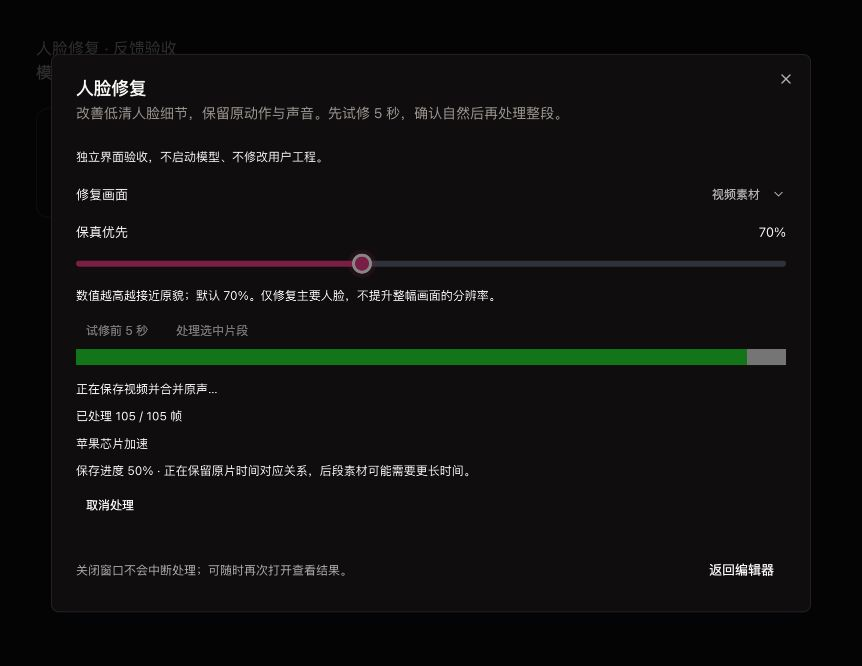

上图为真实修复面板的独立界面验收：用模拟任务展示保存 50% 的状态，不包含私人真人素材，也不作为模型处理性能证据。

**1.4.7 正式安装版验收：** Mac 实际桌面点击摄像头处理、应用与恢复，确认成功提示和已应用按钮；独立接口完成摄像头 15 帧及普通视频 12 帧修复、保存进度、导出和恢复，导出声音一致且完整解码通过。未修改用户原工程；Windows／Linux 桌面与 GPU 实机清单未执行。

**1.4.6 安装包验证：** Mac 正式程序从只读安装映像启动，隔离工程中的摄像头 WebM 完成 15 帧修复，普通视频完成 12 帧；应用、1080p／30 帧导出和恢复原片通过，两种素材的导出声音一致、画面变化且完整解码通过。该轮未替换用户应用，也未重复桌面点击与跨平台硬件实机清单。

**1.4.6：摄像头修复时间读取。** 修复 WebM 将毫秒时钟误报为 1000 帧而无法处理的问题，用现有视频引擎探测真实时间戳并按时间解码；保持源时间位置和原声，不增加模型或探测程序。摄像头原片短段与普通 24 帧带声音素材已通过源码回归，各平台发行包验证见进度记录。

**1.4.5：人脸修复弹窗。** 片段特效只保留「人脸修复」按钮，点击后再显示修复目标、保真程度、试修、后台进度、原片对照和应用／恢复操作。关闭弹窗不取消任务。保真滑块采用粉色进度、灰色轨道和白边圆形拖动点，百分比同步变化，方向键每次调节 5%；范围仍为 50%～100%，默认 70%，算法保持不变。

**1.4.4：可选人脸修复。** 选中摄像头或真人视频片段，在「片段特效 → 人脸修复」先试修前 5 秒，对照原片，再处理整段并应用，支持取消、撤销和恢复原片。模型和 Python 环境独立准备，不并入主安装包，不接入肖像重建。自动选择可用 GPU 或 CPU，加速失败自动回退 CPU；苹果芯片和 CPU 已实测，CUDA／兼容 ROCm 环境尚无对应硬件验收。面板显示实际设备、帧速与预计剩余处理时间；保留原声音、帧率、尺寸及时间。先用短片检查自然程度，不承诺长片无闪烁。实际各平台下载状态以主页下载表为准；本页旧截图不作为新面板截图。

**1.4.3：图片与动画叠放。** 选中图片，在属性面板的「图片层级」选择「动画下方（背景）」；要遮住动画时选「动画上方（遮盖）」。字幕与打码继续显示在上方。默认不改变旧工程，动画本身的不透明背景仍需按构图改成透明。接口样式修改不再缩短跨片段图片；主视频明确裁切会从成片中关闭，真实空轨和独立动画画面保留。

**1.4.2：框选整体移动。** 多个视频、音频、动画与视觉效果可保持相对时间一起拖动，时长和轨道归属不变，并可一次撤销；拖动片段边缘仍单独裁切。整个选区统一在零点停止，避免相互错位。

下面的新动画、分类、社交卡、AI 设置与导出截图拍自 1.1.0 独立演示工程；其他图片沿用已公开的录制和功能演示。全部为真实软件画面，演示中的模型数字、联系方式与密钥是演示数据。不同功能截图的主题和轨道布局可能不同，以当前版本为准。

### 1.4.1：手机摄像头、旋转与录制反馈

安卓 USB 手机可进入摄像头列表，前后镜头在同一入口选择；设备设置支持 0°／90°／180°／270° 顺时针旋转、等比预览与实际分辨率／帧率显示。小米 13 已完成 1080p／30 帧预览、90° 竖向预览及约 40 秒短录制的暂停／恢复／保存实测。手机接入需要安卓 12 及以上、USB 调试授权及电脑上的 adb 与 scrcpy；连接工具未内置，当前路线面向 macOS／Linux，其他平台实机仍待验证。

macOS 指示条新增麦克风和系统声音两路实时音频波形，以图标区分；抠像预览同步画面与遮罩，减少背景闪现；修复暂停恢复后过期画面时间戳造成的写入失败。详情见[发行说明](../releases/1.4.1.md)。人脸修复在 1.4.4 中作为独立可选处理加入。

### 1.4.0：硬件设备、六个新动效方向与实时放大镜

素材库新增 246 个动画，共 914 项、333 张入口卡；新增「硬件设备」「AI 原理」「流程架构」三个分类。新场景全部由黑粉录屏原生绘制：深色霓虹、透明背景，文案是可改的中文文字，数字是参数。

| 方向 | 内容 |
|---|---|
| 硬件设备（65） | 电脑、显卡、处理器、服务器、交换机等 22 类设备，风扇转动、指示灯、数据流动 |
| AI 原理（24） | 令牌生成、注意力、神经网络、混合专家、扩散去噪、上下文与键值缓存、量化、向量检索、检索增强、智能体、训练与微调、多模态 |
| 流程架构（23） | 线性 2–6 节点、分支汇聚、循环、中心辐射、三层架构、本地部署、时序图、泳道、处理管线；节点图标与高亮步骤是参数 |
| 录屏讲解（47） | 键帽、框选、聚光灯、步骤编号、终端（等宽字 JetBrains Mono）、代码差异、进度、接口请求、通知弹窗、点击光标；**实时放大镜**真正放大下方录屏，预览与导出一致，1–8 倍 |
| 评测数据（31） | 跑分条、柱状、仪表盘、显存占用、价格对比、排行榜、雷达图、计时、折线；改数字后条长、指针、顶点、名次一起变 |
| 品牌包装（23） | 黑粉科技 HTI 标志片头片尾、章节卡、标题与字幕条、姓名条、术语卡、角标（含竖屏） |
| 情绪点缀（28） | 震惊大字、问号、对勾叉号、倒计时、「重点」「免费」「实测」印章、感叹警示、圈注下划线、节拍、闪电星光 |

另有 5 个风格一致的 LottieFiles 免费动画改色后作为对应卡的备选样式。35 个在深色画面上看不清或用「H」占位标志的旧素材重绘成霓虹配色或真实品牌，编号不变；旧包随软件保留，旧工程打开、导出与以前相同。带发光、柔影和描边的动画预览与导出提速，画面逐像素不变：新场景 1080p 导出全部在 55 帧/秒以上（改前最慢 0.5 帧/秒）。接口模式导出被中断不再留下 0 字节文件。

### 1.3.0：新增 300 个动画

点赞订阅、成功提示、加载、箭头手势、手绘强调、彩带、消息气泡、科技图标、图表、转场和抽象动效等 300 个动画，由 LottieFiles 免费动画转换成可编辑的原生动画，每项与原动画逐帧比对通过才入库。

### 1.2.1：大动画预览也流畅

预览播放时后台提前画好播放头前方的画面，缓存装不下时也会保留一部分，体积很大的逐帧动画循环播放不再卡顿；导出画面不变。

### 1.2.0：动画更快

含大动画的工程打开约快 9 倍，修改立即显示，循环播放复杂动画直接复用画好的帧；导出画面与上一版逐帧一致。工程格式随之升级：旧工程第一次打开时自动迁移，并在原文件旁留一份备份。

### 原生动画：自己生成画面

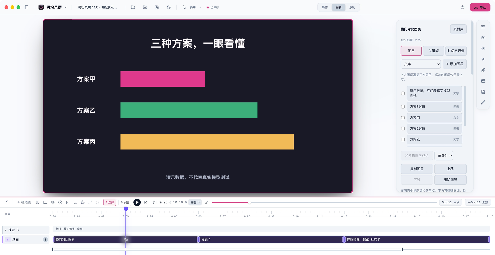

- 独立「动画」片段无需底层视频，可以带背景，直接与录屏、图片、其他视频和 TTS 配音组成整条视频。
- 文字、图片、形状、矢量图形、图表与箭头组成图层；图层支持顺序、分组、多选、隐藏、锁定和复制。
- 在预览中拖动、拉角点，或输入精确参数；位置、尺寸、透明度、旋转、颜色和数值支持关键帧与缓动。
- Rust 合成器逐帧计算，预览与导出共用场景逻辑。AI 通过 JSON 场景数据生成和修改内容，不需要添加 Remotion 运行环境。

### 动画时间、速度与播放方式

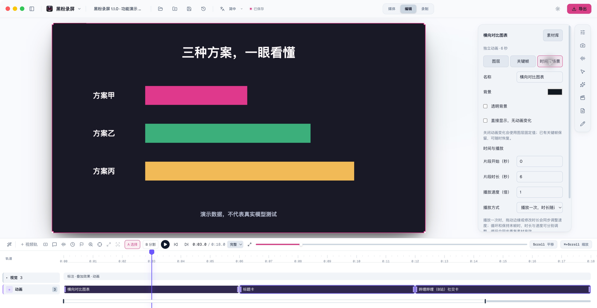

开始时间、片段时长和速度都能调整，可一次播放、循环或保持末帧。一次播放时拖动边缘会同步调整速度；循环和保持模式可分开调整。切分后保留连续源时间；不想要变化过程时可选择「直接显示，无动画变化」，已有关键帧仍保留。

### 素材库：按用途选择，减少重复

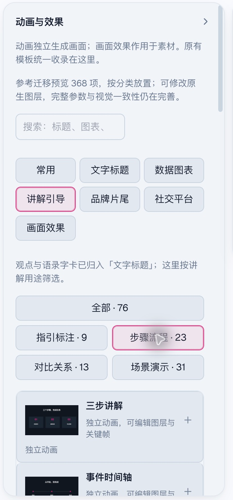

| 分类 | 常见内容 |
|---|---|
| 常用 | 标题卡、数字滚动、对比图表、引导箭头、高亮框、姓名条 |
| 文字标题 | 章节、大字、引言、观点强调、字幕样式 |
| 数据图表 | 指标、图表、数字、声音可视化 |
| 讲解引导 | 指引标注、步骤流程、对比关系、场景演示 |
| 品牌片尾 | 品牌、结尾、行动提示、水印 |
| 社交平台 | 国内外平台卡、账号与内容展示 |
| 画面效果 | 聚焦、色调、蒙版、故障等画面处理 |
| 硬件设备 | 电脑、显卡、处理器、服务器、网络设备等 22 类 |
| AI 原理 | 令牌、注意力、神经网络、检索、智能体、微调等原理图解 |
| 流程架构 | 流程节点、分支循环、架构图、时序图、泳道 |

当前共 **333 张分类入口卡**；讲解引导 **108 张**。23 个观点／语录示例合并为文字标题中的「观点强调字卡」，相似样式在面板中切换。简短用途标题可换行，完整信息悬停查看，原名和用途均可搜索。

内置常用动画 16 种，另有 17 平台社交卡；参考迁移预览 368 项；另有 300 个由 LottieFiles 免费动画转换的原生动画（1.3.0）与 1.4.0 新增的 246 个动画，同类样式合并展示。卡片明确标识「独立动画」「叠加模板」「迁移预览」。迁移预览仍有完整源参数重算、复杂滤镜和动态视觉一致性待完善，并非全部参考样例的完整克隆。

### 中国常见社交平台，一张卡切换

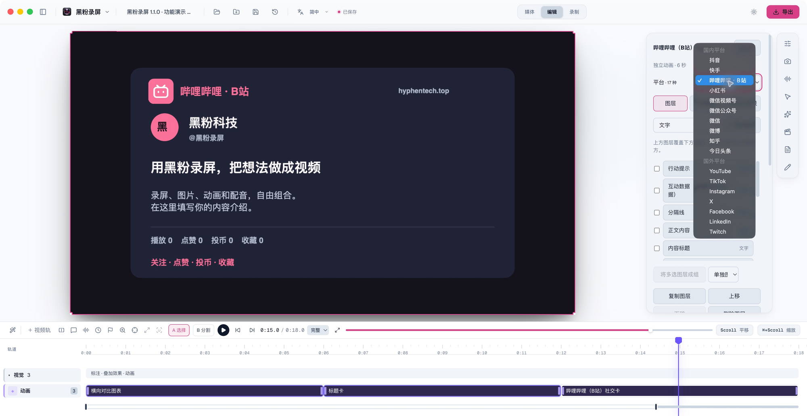

国内包括抖音、快手、哔哩哔哩、小红书、微信视频号、微信公众号、微信、微博、知乎、今日头条；海外包括 YouTube、TikTok、Instagram、X、Facebook、LinkedIn、Twitch。每个平台有标志与配色，切换后保留修改过的账号、标题和正文，互动数字由使用者填写真实数据。

### 屏幕、摄像头与声音一起录

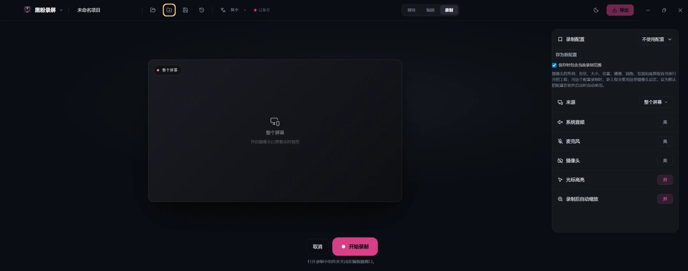

整个屏幕、单个窗口或框选区域；区域可锁定比例，macOS 可单击窗口取范围。摄像头、麦克风和系统声音同步录制，鼠标轨迹保留给自动缩放与光标效果。设备、范围和摄像头外观可存成多套录制配置。控制条可横向或纵向显示。区域框选目前支持 macOS／Windows；Linux 使用桌面门户。

### 多轨剪辑与整洁时间线

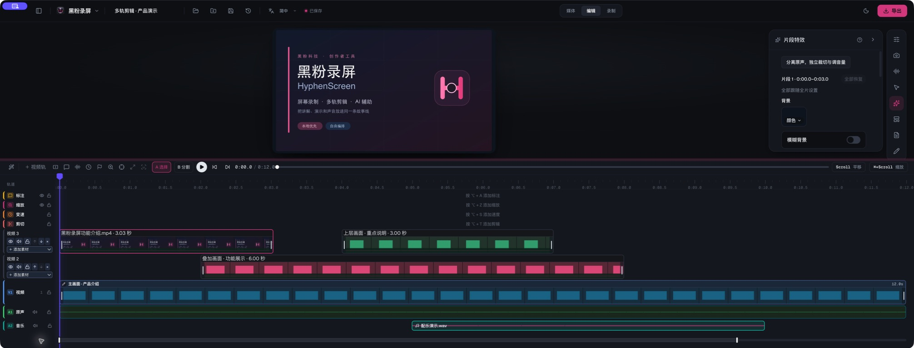

批量导入视频与音频，视频轨数不设固定上限，上层可见画面覆盖下层，音频叠加混音。支持分割、移动、拖边裁切／恢复源内容、逐帧微调、标记和转场。常用操作放在分类右键菜单中。

标注、叠加效果和动画合为可展开的「视觉」分组，支持混合框选、批量删除与一次撤销。无素材的轨道自动隐藏；有内容但被隐藏、停用或静音的轨道仍保留。波形按可见区间与设备像素绘制，分段后仍按源时间取样。

A／B 选择和刀片，J／K／L 播放，I／O 入出点，M 标记，方向键逐帧；滚轮平移、组合键加滚轮缩放。复杂工程可降低预览分辨率，导出始终用完整分辨率。

### 平滑缩放与预览中直接调整

录制后根据鼠标停留与操作位置推荐缩放，支持平滑过渡、鼠标跟随或固定焦点。暂停时直接点选画面、摄像头、字幕和适用的标注／模板，拖动位置或调整大小。屏幕画面保持原比例，外框不拉伸内容；选择控件限制在预览区域，弹窗保持可操作。

### 摄像头布局、全屏与描边

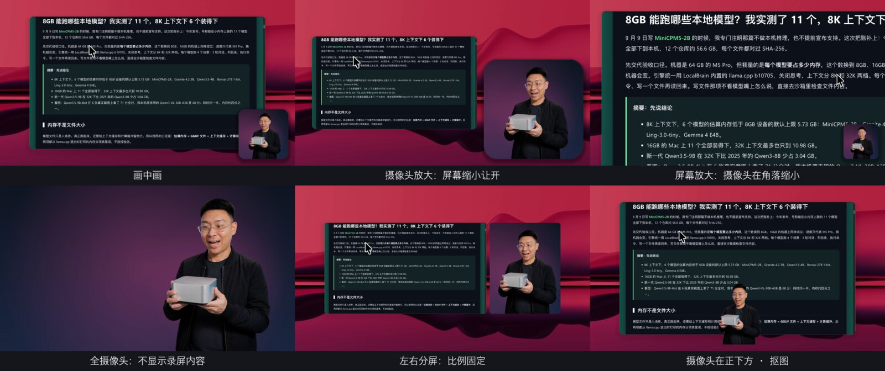

画中画、左右分屏、上下分屏，可对调画面、调分隔比例。全摄像头区间可跨视频片段，进入可直接硬切，也可保留平滑变化。摄像头位置、大小、形状、圆角与镜像可调，描边支持纯色框和环绕渐变脉冲，可调颜色和粗度。背景支持图片、颜色、渐变与模糊；摄像头背景模糊、抠图和替换目前仅 macOS。

### 字幕可手改，中文排版更自然

本机转写生成字幕，可用内置识别或连接 LocalBrain。支持手动修改、搜索定位、恢复原文和多组字幕样式；字号、颜色、底板、位置、每行字数可调。中文按词语换行，数字和英文型号不拆开，预览与导出采用同一换行结果。

### 清晰人声与自然的音乐躲避

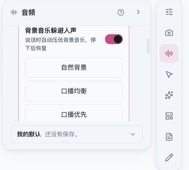

音频可独立裁切、分离原声、逐段调整音量（-60 至 +36 dB），并使用低切、均衡、压缩、限幅和响度处理。人声隔离在本机处理，目前仅 macOS。音乐躲避有三种预设，可调压低幅度、提前量、停顿保持和恢复时长，让口播与背景音乐更平稳衔接。

### AI：订阅、本地模型与自选 API

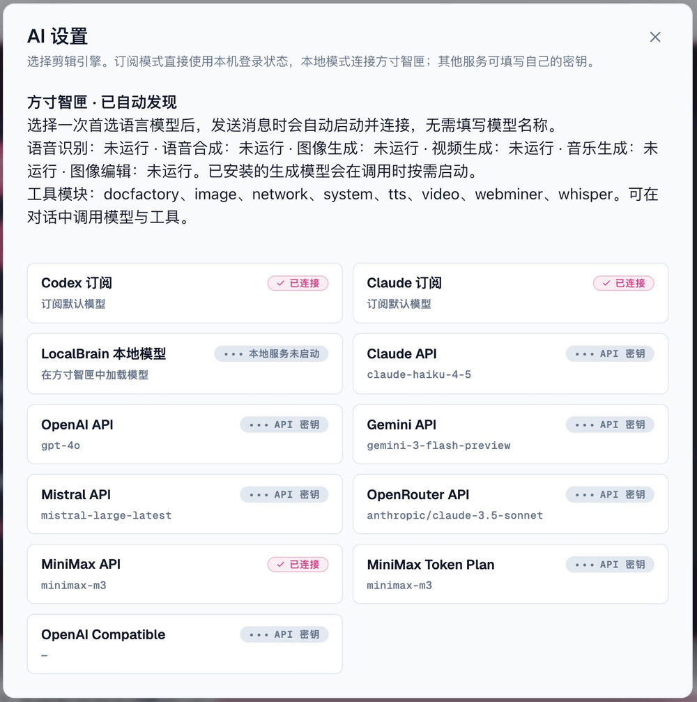

| 连接方式 | 使用方式 |
|---|---|
| Codex 订阅 | 检测官方客户端与本机登录，失败时明显提示登录，提供登录兜底入口 |
| Claude 订阅 | 使用本机 Claude Code 登录；认证失效时提示重新登录 |
| LocalBrain 本地模型 | 发现方寸智匣，选择首选语言模型并按需连接，显示实际运行状态 |
| 模型 API | OpenAI、Claude、Gemini、Mistral、OpenRouter、MiniMax 和 OpenAI 兼容接口 |
| MiniMax Token Plan | 国内／国际地址分别配置，使用对应平台的密钥 |

快速处理模板覆盖口播精剪、停顿压缩、口头禅、重复与重录、人声处理、音乐躲避、自动缩放、打码、横转竖、转场和成片体检。当前 MCP 暴露 **92 个工具**，内置对话与外部代理可调用已实现的编辑能力；AI 可以生成／修改动画场景、图层、关键帧和已绑定参数。

订阅使用需要对应账号与可用额度，API 自行提供密钥。本地服务是否可用以实际检测和模型响应为准；并非所有列出的本地模型都已逐一验证。AI 剪辑结果请在预览中复核。

### 自动打码与发布前体检


本机文字识别找出邮箱、电话、证件卡号、密钥与自定义关键词，自动添加马赛克或模糊，跟随缩放、裁剪和画面变化。自动识别目前仅 macOS，手动打码各平台可用。

导出后检查成片响度与真峰值、静音、黑屏、卡帧、时长及字幕／标题边界，问题可标回时间线；敏感文字回读检查目前仅 macOS。

### 横屏、竖屏与导出

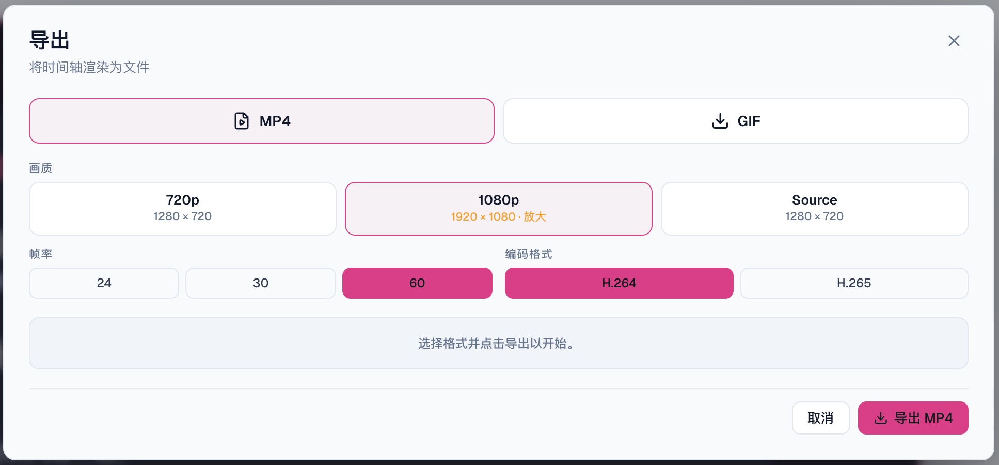

MP4／GIF、720p／1080p／源分辨率、24／30／60 帧及 H.264／H.265。高于源尺寸时的「放大」表示上采样，不会凭空补出原素材没有的细节。横屏录屏可选精彩片段改为 9:16，按操作位置裁切或完整保留网页／文档，搭配标题和字幕。

**1.4.0 起：** 导出的视频和 GIF 右下角带一个小的「黑粉科技」标志（品牌图标加文字，约占 1080p 画面 150×46 像素，随画面明暗自动换浅色／深色字），作为软件使用标识，不能关闭；编辑时的预览不显示它。

### 存储位置与工程恢复

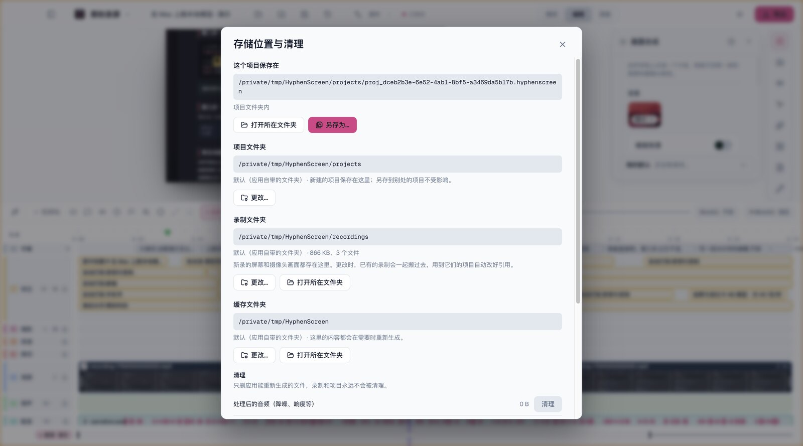

项目、录制和缓存目录可设在外接硬盘；修改录制目录时迁移已有录制并更新工程引用。处理音频、波形、转写等缓存分别查看和清理。

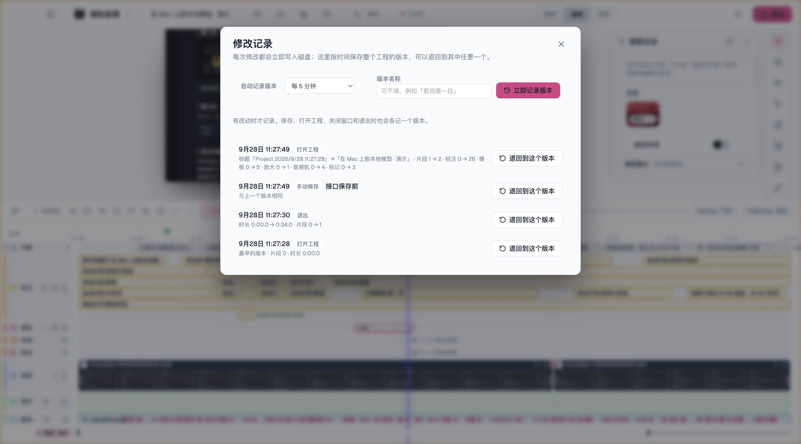

工程修改自动保存，支持定时版本记录、手动命名和回退。最近项目列表与浏览文件均可打开工程。

### 当前验证范围

Mac 已安装 1.4.5，签名、磁盘映像及 427 个文件／符号链接核对通过。正式桌面通过独立工程打开单按钮与弹窗、70%→85% 保真调节、关闭后继续处理、应用、播放与恢复；滑块的真实界面截图已查看，含私人出镜内容而未公开。安装版接口完成 1080p／24 帧短片修复及导出，前后解码音频完全一致，完整回归 4395 项通过、2 项跳过。此次没有重跑其它编辑、录制与物理摄像头的整套桌面流程；Windows／Linux 桌面与人脸修复硬件仍待实机验收。图片叠放、选区整体移动、手机摄像头及 MPS／CPU 加速沿用此前实测。本页动画截图拍自 1.1.0 演示工程；平台专属能力和参考动画边界见对应说明。

## 安装

- **macOS（Apple 芯片）**：打开 DMG，把「黑粉录屏 HyphenScreen.app」拖进「应用程序」。安装包用黑粉科技本机证书签名、**没有做苹果公证**，首次打开会被拦下：在「应用程序」里右键点图标选「打开」，或先执行
  ```bash
  xattr -dr com.apple.quarantine "/Applications/黑粉录屏 HyphenScreen.app"
  ```
- **Windows 10/11 x64**：运行安装程序，可自选安装目录。**未做代码签名**，SmartScreen 会提示，点「更多信息 → 仍要运行」。
- **Linux x64**：AppImage 需要 FUSE 2（Arch `fuse2`、Debian/Ubuntu `libfuse2`），`chmod +x` 后直接运行；deb 与 pacman 已声明依赖（Vulkan 驱动、`xdg-desktop-portal` 及桌面对应后端、ALSA、libgomp）。基线为 glibc 2.35。

录屏需要系统授权：macOS 在「系统设置 → 隐私与安全性 → 屏幕录制」里勾选；Linux 的录屏全部经 xdg-desktop-portal，需要装上桌面对应的后端（`-gnome`、`-kde`、`-wlr` 等）。

## 说明

- 人声隔离、自动敏感文字识别、成片文字回读和摄像头背景处理目前仅 macOS；区域框选支持 macOS 与 Windows。Windows／Linux 安装包已通过构建与包内检查，桌面交互仍需对应系统实机核验。
- 可从应用菜单检查更新，或从本页下载最新包覆盖安装。这里只保留最新公开版本。

版权所有 © 2026 黑粉科技。必要的第三方许可证及原始版权声明随安装包附带。
