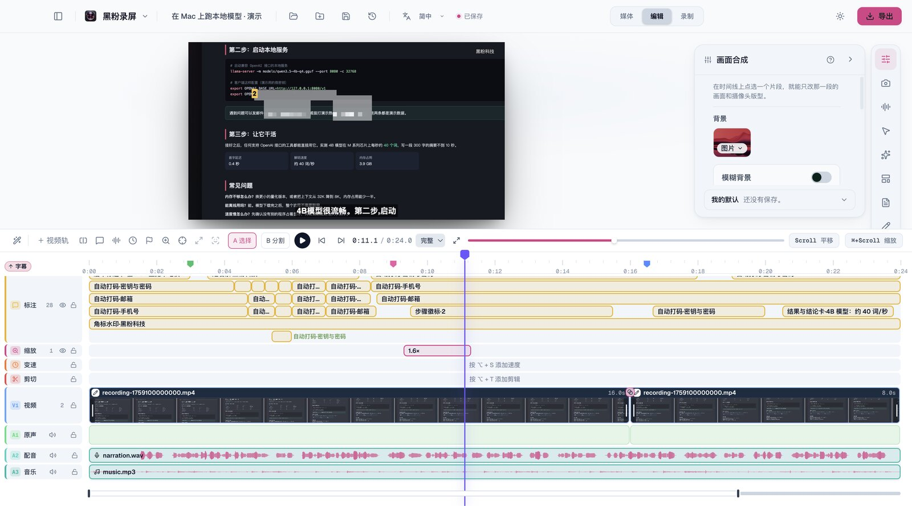
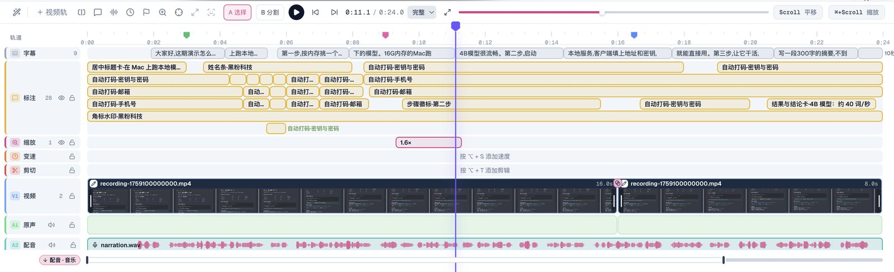
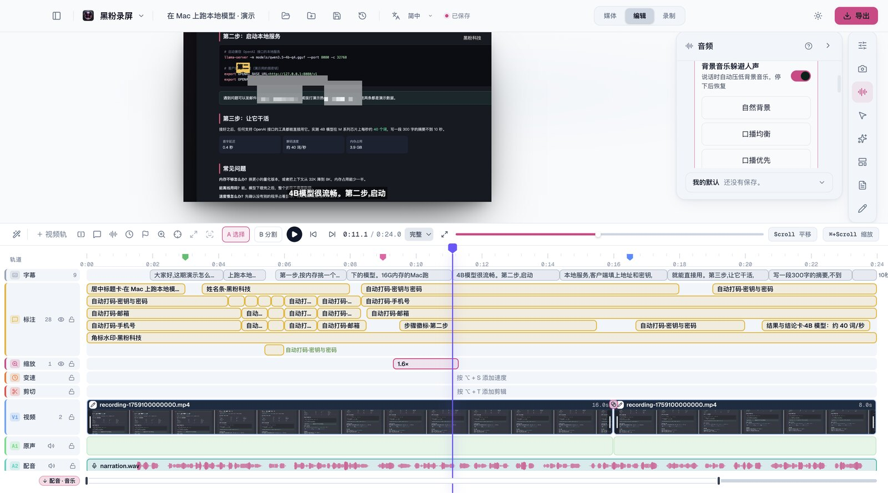
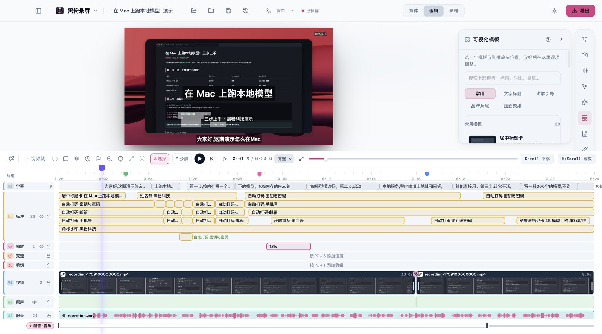
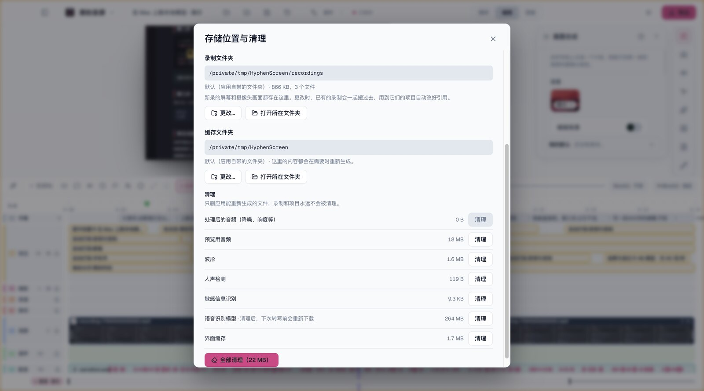

# 黑粉录屏 HyphenScreen · 下载

黑粉科技的桌面录屏与智能剪辑软件。本仓库只存放安装包、校验和与发行说明；源码在独立的私有仓库。

**当前版本：[黑粉录屏 1.0.2 · 正式版](https://github.com/HackerChi-Hub/HyphenScreen-Releases/releases/tag/v1.0.2)**（每个平台只保留最新的一版）。

> 1.0.2 目前提供 macOS 安装包；Windows 继续提供 [黑粉录屏 1.0.1 · 正式版](https://github.com/HackerChi-Hub/HyphenScreen-Releases/releases/tag/v1.0.1)，尚未发布 1.0.2 的 Windows 版；Linux 继续提供 [黑粉录屏 1.0.1 · 正式版](https://github.com/HackerChi-Hub/HyphenScreen-Releases/releases/tag/v1.0.1)，尚未发布 1.0.2 的 Linux 版。

## 软件介绍

黑粉录屏是黑粉科技的桌面录屏与剪辑软件：把屏幕、摄像头和声音一次录好，在同一个窗口里剪辑、加字幕和效果，导出横屏或竖屏成片。专门为软件教程、工具演示和口播讲解这类「录完就要剪、剪完就要发」的视频打磨。

**语言介绍：** 简体中文 · [繁體中文](README.zh-TW.md) · [English](README.en.md) · [日本語](README.ja.md)

### 亮点

- **录制省心**：整个屏幕、单个窗口或框选区域，摄像头、麦克风和系统声音一起录，鼠标轨迹同步记下，剪辑时按鼠标停留自动推荐平滑放大。
- **多素材、多视频轨剪辑**：批量导入视频与音频，视频轨道不设固定数量上限；上层覆盖画面、各层声音混合。拖动片段位置与左右边缘完成编排和裁切，字幕、标注、缩放与声音清楚分轨。
- **字幕与中文排版**：本机转写生成字幕，中文按词语换行，数字和英文型号不拆开，预览和导出断在同一处。
- **AI 帮你剪**：内置聊天可以用 Codex 订阅（复用本机登录）或本地模型，用一句话完成口播精剪、压缩停顿、去掉口头禅、横屏转竖屏精彩片段；外部 AI 也能通过 MCP 接口调用同一套剪辑工具。
- **发布前把关**：导出后「成片体检」检查响度、无声与黑屏、画面卡住、字幕越界，并回读画面确认邮箱、手机号、密钥等敏感信息有没有露出；自动打码在放大、裁剪、页面滚动和改成竖屏后依然盖住。
- **文件放哪自己定**：项目、录制和缓存都能指定文件夹（比如外接硬盘），已有的录制一起搬过去、引用自动改好；各类缓存分别列出大小，一键清理。
- **本地优先**：录制内容、工程文件、转写和打码识别都在你的电脑上处理，没有账号体系；匿名使用统计只做设备计数，一键可关。

### 适合做什么

- 软件操作教程、编程与工具演示、产品功能讲解
- 带摄像头的知识分享、课程与直播回放整理
- 把一段横屏录屏剪成 9:16 短视频，发到短视频平台

### 系统要求

| 平台 | 要求 |
|---|---|
| macOS | 13 及以上，Apple 芯片（M 系列） |
| Windows | Windows 10 / 11 64 位；显卡需支持 D3D11 硬件视频解码（预览与导出都用它） |
| Linux | x86_64，glibc 2.35 及以上（Ubuntu 22.04、Debian 12 及更新）；Vulkan 驱动；`xdg-desktop-portal` 及桌面对应后端 |

### 常见问题

- **要付费或注册吗？** 不用，下载即可使用，没有账号。
- **安装时系统说来源不明、不安全？** 目前没有做苹果公证和 Windows 代码签名，按下方「安装」里的步骤放行即可；每个安装包的 SHA-256 都列在下载表里，可以自行核对。
- **我的录屏会被上传吗？** 不会。录制、剪辑、转写和导出都在本机完成。只有在你主动使用 AI 聊天时，对话和工程里的相关文字会发给你选择的模型服务（Codex 订阅或本地模型）。
- **怎么升级？** 左上角「黑粉录屏」菜单里的「检查更新」会告诉你有没有新版本（不会自动下载安装）。新版本发布到本页后，下载安装覆盖即可；工程文件是否兼容、有哪些变化，写在每一版的发行说明里。
- **旧版本在哪里下载？** 本页每个平台只保留最新的一版。

## 下载

到[发行页面](https://github.com/HackerChi-Hub/HyphenScreen-Releases/releases)按平台取包。

| 平台 | 文件 | SHA-256 |
|---|---|---|
| macOS 13+（Apple 芯片 arm64） | `HyphenScreen_1.0.2_arm64.dmg` | `3bc0bed666bc742940a2898818b578d6f297ed26e48dee6f338cebe187def887` |
| Windows 10/11（x64）· 1.0.1 版 | `HyphenScreen_1.0.1_x64-setup.exe` | `1e055ad6637adc3804c9485d070dbae3097c94cb7db1a512bdfd2ee86a9ae8ab` |
| Linux（x86_64）· 1.0.1 版 | `HyphenScreen_1.0.1_x86_64.AppImage` | `961b61bda9faef531e1949237c1d802fc0c4747b37f595f4abf62e01775112ab` |
| Debian / Ubuntu（amd64）· 1.0.1 版 | `HyphenScreen_1.0.1_amd64.deb` | `9d534113e283d0c81fb8d1f030cde9f7190cf4544ef43f2702e748ffde92b9ce` |
| Arch Linux（x86_64）· 1.0.1 版 | `HyphenScreen_1.0.1_x64.pacman` | `8b7b88dbd96f5522938f6d031e93dffb19ce74678a44410403bf412075c244ff` |

同一页附带各平台的 `SHA256SUMS*.txt` 与 `release-manifest.json`，可核对文件完整性与构建来源。

> 下面的功能一览按 1.0.2 介绍；Windows 暂为 1.0.1，不包含之后加入的功能；Linux 暂为 1.0.1，不包含之后加入的功能，各版变化见发行页面上的发行说明。

## 功能一览

下面的截图都是实机画面。演示工程用专门制作的素材：一段滚动网页的录屏、合成的旁白和背景音乐，里面的邮箱、电话和密钥都是假的；摄像头的两张用的是演示者本人的画面。

### 一眼看全



预览、检查器和时间线在同一个窗口里。上图这一刻用到了：按鼠标停留自动推荐的放大、钉在画面上的步骤徽标、本机转写的字幕、自动打码、角标水印；时间线上还有三个标记点和两个片段之间的叠化转场。

### 录制


- 整个屏幕、单个窗口，或框选任意区域（可锁定 16:9、9:16、1:1、4:3）；macOS 上单击窗口可直接取它的范围。框选支持 macOS 与 Windows。
- 摄像头、麦克风和系统声音同步录制，鼠标轨迹一起记录，供自动放大和光标效果使用。摄像头按设备支持的最高清晰度录制，录制前的预览与录制取同一档。
- 麦克风、摄像头、录制范围和摄像头外观可以存成多套录制配置，一键切换，并指定启动时默认使用的一套。

### 剪辑时间线



- 按达芬奇的轨道样式排布：字幕、标注、缩放、变速、剪切、V1 视频（上方可继续加视频轨）、A1 原声、A2 起是配音和音乐；轨道头写明名称和条目数，可以锁定、隐藏、静音、调整顺序。
- 条目直接写出内容：标注文字、模板名、打码类别、放大倍数、剪掉的时长、字幕句子；重叠的条目自动分行。
- 视频片段带名称条和缩略图，原声单独成轨并与画面联动；配音与音乐的波形按屏幕上看得见的那一段、以设备像素绘制，放得越大越清楚。
- 按 M 打标记点，可命名、换颜色，标记跟着画面走，可以复制成视频简介的章节时间码。
- 熟悉的操作：A/B 选择与刀片、Cmd+B 分割、J/K/L 播放、I/O 入出点、方向键逐帧、撤销与重做。

### 多轨与画布直接编辑


- 一次导入多个视频和音频；视频轨道不设固定数量上限，上层的可见画面覆盖下层，声音叠加混合。拖动片段位置与左右边缘完成编排和裁切，按住 Shift 精调，方向键逐帧。
- 暂停时直接在预览里点选对象：录屏画面与摄像头可移动、等比缩放；分屏可整体移动，拖动中线调摄像头占比；字幕、文字、图片、箭头、模糊标注和模板都能直接拖动和调整大小。
- 全屏预览（F 进入，Esc 退出）；预览分辨率可选完整、3/4、1/2、1/3、1/4，复杂工程放低档位更流畅，导出始终用完整分辨率。

### 画面与摄像头


- 画中画、左右分屏或上下分屏；分屏一键对调录屏和摄像头的位置。屏幕保持原比例完整显示；背景可以是图片、颜色、渐变或模糊。
- 摄像头抠图、背景模糊、自定义背景：抠图边缘按摄像头原画面的真实轮廓放大，手指、眼镜腿、肩膀的轮廓清楚（macOS）；模糊只糊背景，预览和导出一致。
- 画中画里屏幕和摄像头互相让位：屏幕放大时摄像头在角落缩小，摄像头放大时屏幕缩小并移开；缩小的摄像头按像素覆盖范围取样，不闪不糊。
- 「全摄像头」这段只显示摄像头；「摄像头放大」按倍数放大；进入和退出可以平滑过渡，也可以硬切。摄像头边框有纯色框和环绕渐变脉冲。


- 每个片段都可以有自己的版型和效果：背景、阴影、圆角、内边距、运动模糊、摄像头布局与位置、摄像头背景与镜像、光标、原声音量。没单独设置的项跟随全片。

### 字幕与中文排版

- 本机转写生成字幕（内置 Whisper，或连接 LocalBrain），保留识别器给的真实时间；静音、音乐这类非语音标注不会变成字幕。
- 字幕可以手动修改、搜索定位、恢复原文，六组样式可选；字号、颜色、底板、位置、每行字数都能调。
- 按中文词语换行：「内存多大 / 先跑哪个模型」不会切开「先跑」「哪个」，数字与英文型号不拆开，多行尽量等长，预览和导出断在同一处。

### 声音



- 人声隔离（macOS）：本机神经网络去除键盘、风扇等噪声，只保留人声；另有低切、均衡、压缩、限幅与预设。
- 背景音乐躲避人声：说话时自动压低音乐、停下后恢复；有自然背景、口播均衡、口播优先三种预设，也能单独调提前压低、停顿保持和恢复时长。
- 原声可以分离成独立音轨、刀切、拖边裁切、逐段调音量（-60 至 +36 dB）；配音和音乐轨可以各自选择声音处理。
- 在视频片段上切一刀，挂在它上面的配音和音乐会跟着分成两段，接着播放。

### 可视化模板与画面特效



- 35 款模板分在「常用、文字标题、讲解引导、品牌片尾、画面效果」里，搜索跨全部分类；标题卡、姓名条、步骤徽标、按键提示、聚焦虚化、结果与结论卡、前后对比卡、片尾与行动提示、角标水印等。
- 13 套文字样式和 11 个画面特效复现自黑粉剪辑：编辑部章节标题、得意黑压屏大标、手写体引言；暖调纪录片、青橙电影、暗角、RGB 故障偏移、矩形蒙版、深色证据底板等。每项参数都能改，都能加淡入淡出。
- 模板显示在标注轨道上，随所在片段移动、分割和删除；随安装包附带 9 款字体，电脑上没装也照样显示。

### 转场


- 12 种转场：叠化、黑场、白场、四个方向的擦除与推移、缩放；声音同步淡入淡出。可以逐处设置，也可以一键应用到所有衔接处。

### 自动打码


- 本机文字识别找出画面里的邮箱、手机号、证件号、银行卡号、密钥和自定义关键词，盖上马赛克或模糊（自动识别目前仅 macOS；手动打码各平台都有）。证件号和银行卡号先做校验，误报少。
- 打码跟随放大、倾斜、裁剪和竖屏改版；页面滚动时，框一段一段跟着文字走，只盖文字经过的那一小块，不会盖住半个画面。
- 文字出现前、消失后都留有余量，保证任何一帧都认不出来。

### 成片体检

- 导出后一键检查成片本身：响度与真峰值（给出输出音量建议）、无声和黑屏段落、画面卡住、成片比时间线短、字幕和标题放不下或超出画面；并用文字识别回读画面，确认敏感信息没有露出（回读目前仅 macOS）。
- 发现的问题一键标到时间线上，按 Shift+↓ 逐个查看。

### 竖屏精彩片段

- 横屏录屏的一段转成 9:16 短片：软件操作按鼠标位置裁切，网页和文档整幅保留，标题在上字幕在下，放大只在画面区域内进行。

### AI 剪辑


- 内置聊天可用 Codex 订阅（复用本机官方登录，无需填写密钥）或本地模型；69 个工具覆盖剪辑、声音、字幕、转场、打码、放大、标记点、逐片段特效、可视化模板、插入视频、竖屏精彩片段、导出和成片体检——编辑器里能手动做的操作都有对应的工具。
- 12 个一键模板：口播精剪、压缩停顿、去除口头禅、删除重复与重录、横屏精彩片段转竖屏、发布前体检等。
- 外部 AI 可以通过 MCP 接口调用同一套工具（加上读取、保存、撤销、重做，共 73 个）。

### 项目、修改记录与存储


- 每次修改立即写入磁盘；另外按时间保存整个工程的版本（默认每 5 分钟，只在有改动时），每个版本写明来由和变化，可以退回任意一个，退回本身也能撤销。
- 项目可以另存到任意位置、从任意位置直接打开，或导出一份独立副本；新建项目的默认文件夹可以改到外接硬盘。


- 「存储位置与清理」：录制文件夹可以换到别处，**已有的录制一起搬过去**，所有工程和修改记录里的引用自动改好；先复制、核对，最后才删原件，刚结束还在收尾的录制不会被搬走一半，搬过去的文件保留原来的修改日期。
- 缓存文件夹也能换位置：旧缓存直接删掉，新位置按需重新生成。硬盘没接时新文件暂存默认位置，并明确提示。



- 清理：处理后的音频、预览音频、波形、人声检测、打码识别、语音识别模型、界面缓存分别列出大小，每类单独清，或一键全部清理（不含语音识别模型）。录制和工程永远不在清理范围内。

### 关闭与退出

- 点窗口的关闭按钮只收起界面，软件留在托盘里（macOS 在菜单栏），点托盘图标即可回来；在托盘菜单里选「完全退出」才退出。
- 退出前先把正在编辑的工程写入磁盘并读回核对；退出时软件启动的后台进程一并结束，不会留在后台占资源。

## 安装

- **macOS（Apple 芯片）**：打开 DMG，把「黑粉录屏 HyphenScreen.app」拖进「应用程序」。安装包用黑粉科技本机证书签名、**没有做苹果公证**，首次打开会被拦下：在「应用程序」里右键点图标选「打开」，或先执行
  ```bash
  xattr -dr com.apple.quarantine "/Applications/黑粉录屏 HyphenScreen.app"
  ```
- **Windows 10/11 x64**：运行安装程序，可自选安装目录。**未做代码签名**，SmartScreen 会提示，点「更多信息 → 仍要运行」。
- **Linux x64**：AppImage 需要 FUSE 2（Arch `fuse2`、Debian/Ubuntu `libfuse2`），`chmod +x` 后直接运行；deb 与 pacman 已声明依赖（Vulkan 驱动、`xdg-desktop-portal` 及桌面对应后端、ALSA、libgomp）。基线为 glibc 2.35。

录屏需要系统授权：macOS 在「系统设置 → 隐私与安全性 → 屏幕录制」里勾选；Linux 的录屏全部经 xdg-desktop-portal，需要装上桌面对应的后端（`-gnome`、`-kde`、`-wlr` 等）。

## 说明

- 人声隔离、自动打码的敏感信息识别、框选时「单击窗口取范围」目前只有 macOS 版有；框选录制区域支持 macOS 与 Windows，Linux 暂不支持；其余功能三平台一致。
- 应用内没有自动更新：新版本发到本页，旧版本会被删除。

版权所有 © 2026 黑粉科技。基于 MIT 许可的 OpenScreen 开发，第三方许可证随安装包附带。
