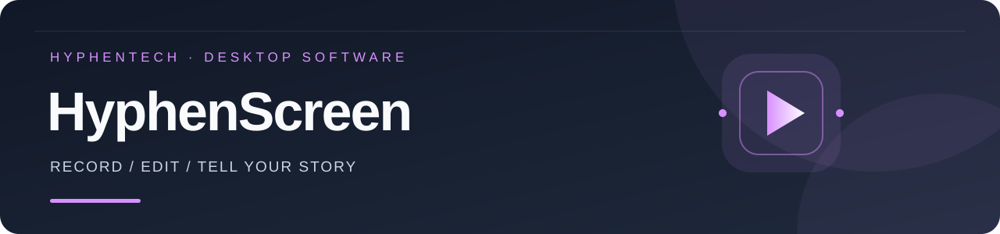

<!-- evergreen:intro:start -->

# 黑粉錄屏 HyphenScreen · 錄製、剪輯與原生動畫

**錄好關鍵操作，用圖片、動畫和配音完成整條影片。**

黑粉科技的桌面錄屏與智慧剪輯軟體，適合軟體教學、產品示範、知識分享和口播影片。在同一個視窗完成錄製、多軌剪輯、字幕、聲音處理、原生動畫和匯出，也可以用自然語言請 AI 協助修改。

<a href="README.md">简体中文</a> | <a href="README.zh-TW.md">繁體中文</a> | <a href="README.en.md">English</a> | <a href="README.ja.md">日本語</a>

 

<!-- evergreen:intro:end -->

<!-- recent-features:start -->
## 近期新增與改進（最近 5 項）

- **1.4.8** · 攝影機全螢幕跨剪切點預覽保持連續，修復切換時短暫露出錄屏。
- **1.4.7** · 人臉修復區分載入、修復、編碼與儲存階段，提供套用及恢復回饋。
- **1.4.6** · 攝影機 WebM 的異常幀率改用真實時間戳進行人臉修復。
- **1.4.5** · 人臉修復集中至獨立視窗，保真滑塊更清楚，關閉後任務繼續。
- **1.4.4** · 選用本機人臉修復：先試修、對照，再套用或恢復；模型與 Python 環境另行準備。
<!-- recent-features:end -->

<!-- evergreen:demos:start -->
## ▶ 使用示範

**錄影設定、滑鼠縮放、動畫與 AI 口播精剪**

| Bilibili | YouTube |
| :---: | :---: |
|  |  |

影片示範的是拍攝時的版本；安裝套件與目前功能以本頁正式發行資訊為準。影片以中文講解。
<!-- evergreen:demos:end -->

## 下載: 1.4.8

| 平台 | 安裝套件 | SHA-256 |
|---|---|---|
| macOS 13+（Apple 芯片 arm64） | [下載 HyphenScreen_1.4.8_arm64.dmg](https://github.com/HackerChi-Hub/HyphenScreen-Releases/releases/download/v1.4.8/HyphenScreen_1.4.8_arm64.dmg) | `fc2008c1d4254b6015664a45f2138245def1bf0d4486479a5e93cf8005e63874` |
| Windows 10/11（x64） | [下載 HyphenScreen_1.4.8_x64-setup.exe](https://github.com/HackerChi-Hub/HyphenScreen-Releases/releases/download/v1.4.8/HyphenScreen_1.4.8_x64-setup.exe) | `c224abb68bb121b0b82c711e3e559a16473ad843b52f7311fcfdf83b30d09837` |
| Linux（x86_64） | [下載 HyphenScreen_1.4.8_x86_64.AppImage](https://github.com/HackerChi-Hub/HyphenScreen-Releases/releases/download/v1.4.8/HyphenScreen_1.4.8_x86_64.AppImage) | `614580b3444b191891233fdf2e780105c8433a37809c9e0145528249f9c60eac` |
| Debian / Ubuntu（amd64） | [下載 HyphenScreen_1.4.8_amd64.deb](https://github.com/HackerChi-Hub/HyphenScreen-Releases/releases/download/v1.4.8/HyphenScreen_1.4.8_amd64.deb) | `6b84244467df0c8c72b989e8dc9e940e05231bda2867b8e5e6b20fe24496c777` |
| Arch Linux（x86_64） | [下載 HyphenScreen_1.4.8_x64.pacman](https://github.com/HackerChi-Hub/HyphenScreen-Releases/releases/download/v1.4.8/HyphenScreen_1.4.8_x64.pacman) | `1f3444ac63f0c6d90fd687aec18465a8c32ae052d15d32dc32b3c7cb359ab091` |

<!-- evergreen:capabilities:start -->

## 一個視窗，完成整個流程

| 環節 | 功能 |
|---|---|
| 錄製 | 螢幕、視窗或區域；攝影機、麥克風、系統聲音；錄製設定與滑鼠軌跡 |
| 剪輯 | 批次匯入影片／音訊，多影片軌道，上層畫面覆蓋、聲音混音 |
| 畫面 | 等比例畫框、子母畫面、上下／左右分割、全攝影機與脈衝描邊 |
| 字幕 | 本機轉寫、手動改字、搜尋、多組樣式與中文換行 |
| 聲音 | 獨立裁切、逐段音量、人聲處理、均衡與背景音樂閃避 |
| 動畫 | 獨立場景、圖層、關鍵影格、緩動、時長與速度 |
| AI | 訂閱登入、本地模型、自選 API、快速處理範本與 MCP 工具 |
| 匯出 | MP4／GIF、橫式／直式、編碼與解析度、打碼與成片檢查 |

## 動畫自己生成畫面

動畫片段不需要墊底影片，可帶背景。只錄開頭與必要操作，其餘搭配圖表、標題、圖片、影片素材及匯入的 TTS 配音。文字、圖片、形狀、向量圖形、圖表和箭頭组成圖層；支援順序、分組、多選、隱藏與鎖定。位置、尺寸、透明度、旋轉、顏色與支援的數值可設定關鍵影格和緩動。

Rust 合成器逐影格計算，預覽和匯出共用場景邏輯；AI 修改 JSON 場景資料，不需要執行 Remotion 程式碼。在預覽中拖曳物件，或精確輸入數值。開始時間、時長、速度可調，支援播放一次、循環、保持末影格和直接靜態顯示。

## 素材依用途分類，同類樣式合併

統一「動畫與效果」入口，分為常用、文字標題、資料圖表、講解引導、品牌片尾、社群平台、畫面效果、硬體裝置、AI 原理、流程架構。目前 **333 張分類入口卡**，其中 **108 張講解引導**依指引標註、步驟流程、對比關係和場景示範篩選。23 個語錄／觀點示例合為一個文字標題家族，樣式在面板切換。標題簡短、可換行，原名仍可搜尋。

內建常用動畫 16 種，另有 17 平台社群卡；參考遷移預覽 368 項；另有 300 個由 LottieFiles 免費動畫轉換的原生動畫。同類配色和樣式不再重複堆卡。遷移預覽的完整來源參數重算、複雜濾鏡和動態視覺一致性仍待完善，並非全部參考範例的完整複製。

社群卡支援抖音、快手、嗶哩嗶哩、小紅書、微信影片號、微信公眾號、微信、微博、知乎、今日頭條，以及 YouTube、TikTok、Instagram、X、Facebook、LinkedIn、Twitch。切換平台保留已修改的帳號、標題和正文。

## 多軌、攝影機與聲音

影片轨道不設固定數量上限，上層可見畫面覆蓋下層、音訊疊加混音。拖動片段兩端裁切或恢復來源內容，支援分割、移動、標記、轉場、分類右鍵選單與逐影格微調。標註、疊加效果和動畫放在可展開的「視覺」分組，支援混合框選與一次復原；無素材的軌道自動隱藏。

預覽中的畫面、攝影機、字幕及適用標註／範本可直接拖動和縮放。保留畫面比例，框架不拉伸內容；錄製後可依滑鼠停留推薦平滑縮放。攝影機支援子母畫面、左右／上下分割，跨片段全螢幕區間可硬切或平滑進入，描邊可調粗細、顏色和漸層脈衝。攝影機背景模糊、去背和替換目前僅 macOS。

字幕可手動修改、搜尋定位與恢復原文，調整字級、顏色、底板、位置和換行。音訊可獨立裁切、分離原聲、逐段調音量（-60 至 +36 dB）。背景音樂閃避有自然背景、口播均衡、口播優先三種設定，可調提前量、停頓保持與恢復。人聲隔離目前僅 macOS，波形隨時間軸放大呈現細節，切分後保留來源時間。

## 自帶 AI，減少重複操作

Codex／Claude 訂閱偵測本機官方客戶端與登入狀態，失敗時顯示明確的登入／重新登入指引，Codex 有登入備援入口。LocalBrain 可發現方寸智匣並按需連接首選語言模型；可用性依實際服務狀態與模型回覆判定，並非所有模型均已逐一驗證。

API 支援 OpenAI、Claude、Gemini、Mistral、OpenRouter、MiniMax、MiniMax Token Plan 及相容接口；MiniMax 國內／國際位址分開配置。快速範本涵蓋口播精剪、停頓、口頭禪、重複重錄、人聲處理、音樂閃避、縮放、打碼、橫轉直與成片檢查。目前 MCP 提供 **92 個工具**，涵蓋已實作的工程、時間軸、字幕、音訊、動畫與匯出操作。AI 修改請在預覽中複核。

## 匯出、保護與工程管理

選擇 MP4／GIF、解析度、影格率與 H.264／H.265。超過來源尺寸的「放大」代表上採樣，不會補出原素材沒有的細節。可將橫式精彩片段改為 9:16。成片檢查涵蓋響度、靜音、黑畫面、卡影格、時長和文字邊界；自動敏感文字辨識及匯出後文字回讀目前僅 macOS，手動打碼各平台可用。

工程、錄製和快取資料夾可自訂到外接硬碟，分類清理快取，利用自動或命名版本記錄恢復工程。

## 下載與平台範圍

軟體可免費下載，不需要黑粉錄屏帳號；模型訂閱和 API 使用自己的帳號、金鑰與額度。錄製和工程保存在本機，雲端 AI 會收到本次請求相關的對話和工程資訊；本地模型推理可留在電腦上。匿名裝置計數可關閉。

- **macOS：** 13 以上、Apple 晶片；DMG 使用本機憑證簽署，未做 Apple 公證。
- **Windows：** 10／11 x64、D3D11 影片解碼；安裝程式未做程式碼簽署。
- **Linux：** x86_64、glibc 2.35 以上、Vulkan 和桌面入口；AppImage、deb、pacman。

安裝步驟與 SHA-256 請見[下載首頁](https://github.com/HackerChi-Hub/HyphenScreen-Releases)。可從選單檢查更新或下載新版覆蓋安裝。Mac 已安裝 1.4.5，427 個檔案與連結符合映像，本機簽名有效。正式桌面通過單按鈕視窗、清楚滑塊、70%→85% 調整、關閉後繼續處理、套用、播放與恢復；安裝版介面另已處理及匯出，解碼原聲完全相同。本次為局部介面驗收，未重跑完整錄製和實體攝影機清單。Windows／Linux 桌面與修復硬體仍待實機驗證。區域框選支援 macOS／Windows；動畫、設定和匯出圖例拍自 Mac 1.1.0 演示工程，使用簡體中文介面。私人修復截圖不公開。

版權所有 © 2026 黑粉科技。必要第三方授權及原始聲明隨軟體附帶；本公開倉庫提供安裝包和說明，原始碼維持私有。
<!-- evergreen:capabilities:end -->

<!-- evergreen:discovery:start -->
## 更多黑粉科技自製軟體

[LocalBrain](https://github.com/HackerChi-Hub/localbrain-releases) · [HyphenScreen](https://github.com/HackerChi-Hub/HyphenScreen-Releases) · [ScreenLex](https://github.com/HackerChi-Hub/screenlex-download) · [HyphenBox](https://github.com/HackerChi-Hub/hyphenbox-release)
<!-- evergreen:discovery:end -->
