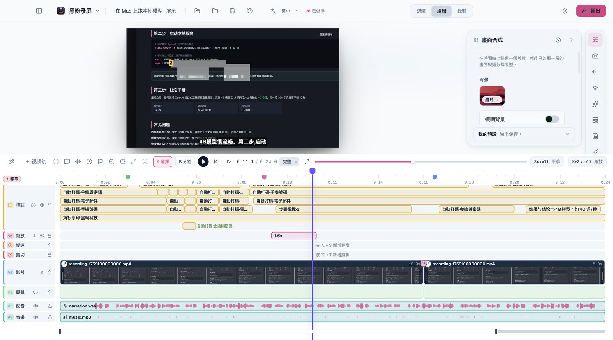
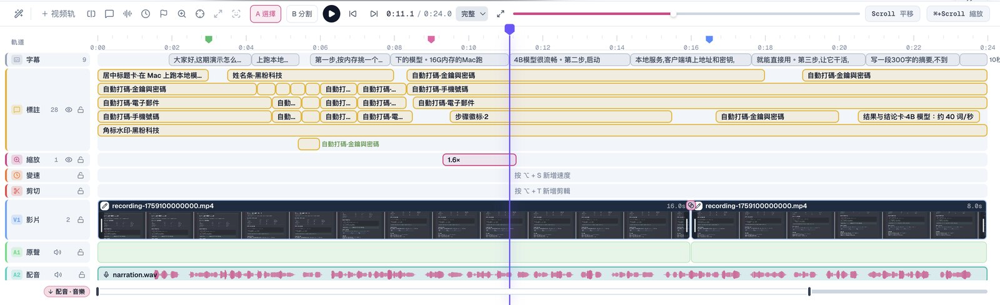
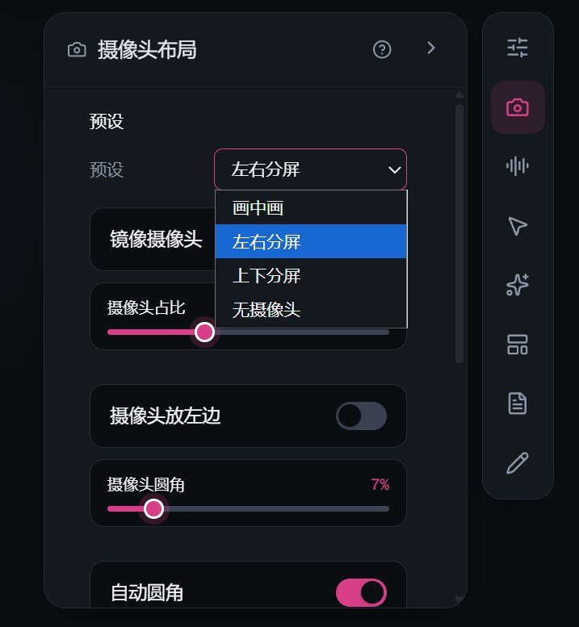
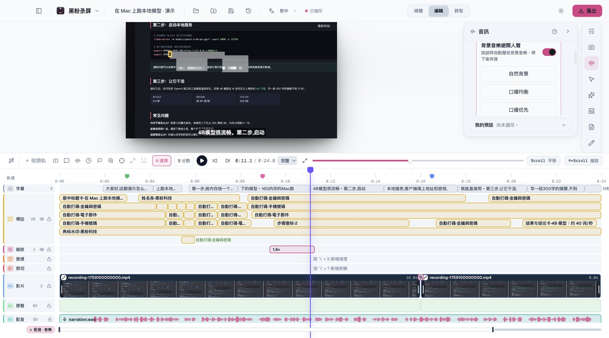
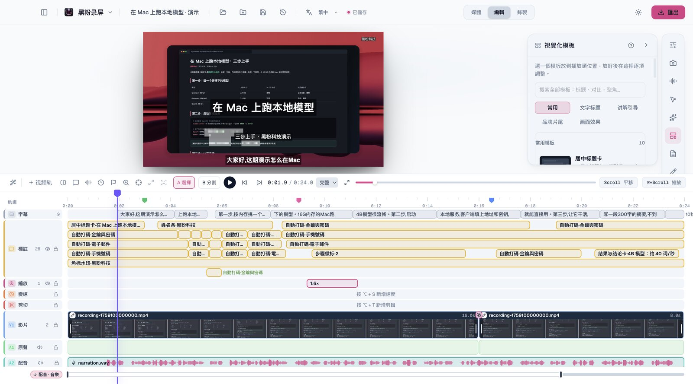
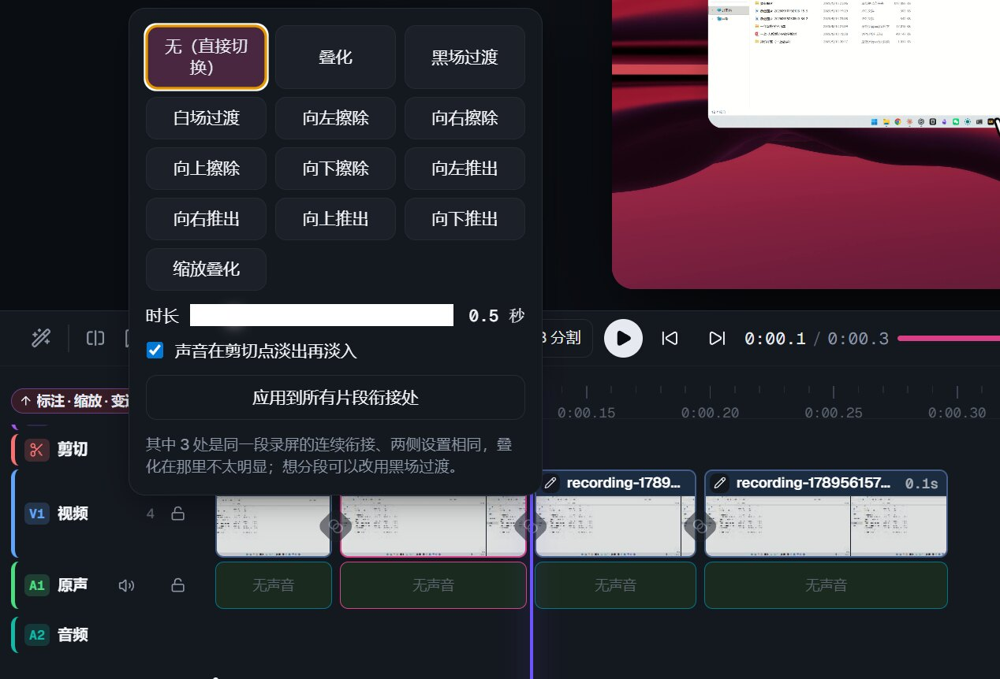
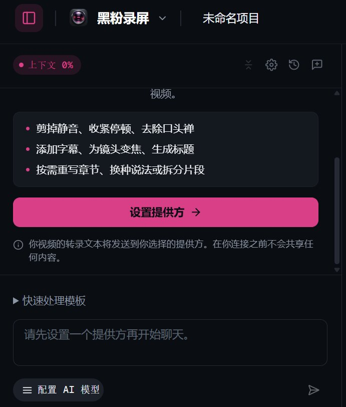
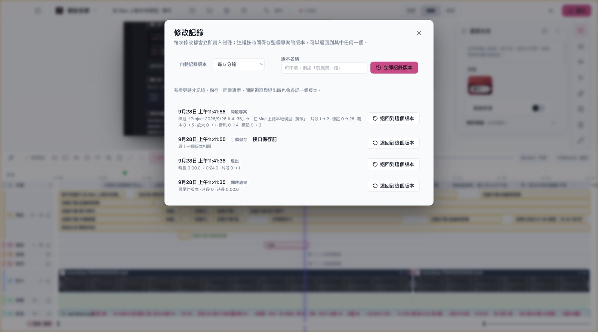
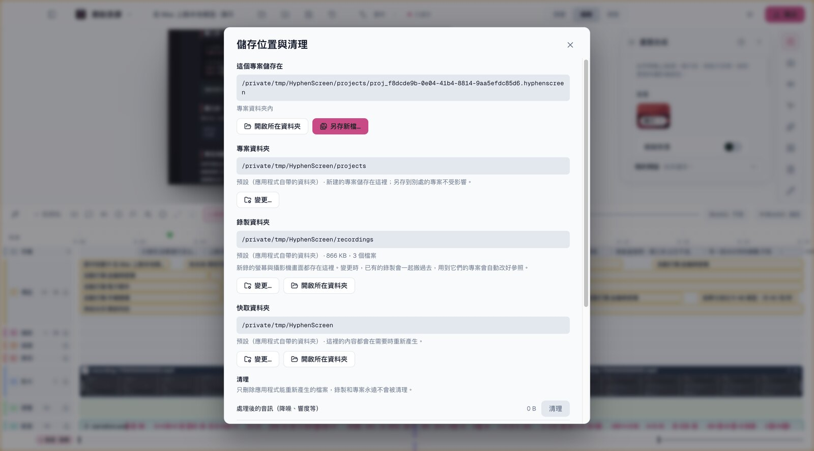
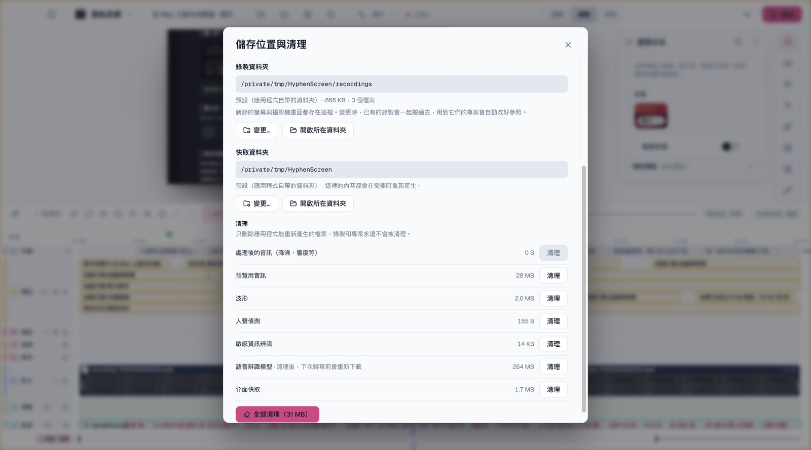

# 黑粉錄屏 HyphenScreen

## 1.0.6 既有動畫固化

保留23項內建預設與326項簡體中文遷移預覽，暫停數量擴充，後續邊使用邊核驗。改善單行文字修改後的寬度適配，AI 可修改文字內容、字級與顏色，並改善已綁定數值參數和原生字形處理。複雜效果與完整參考一致性仍待完善。

## 1.0.5 時間軸與動畫操作

空白軌道自動隱藏，加入素材後顯示；含有靜音或停用素材的軌道仍保留。標註、疊加效果與動畫整合至可展開的「視覺」群組，物件可獨立編輯，也支援混合框選、批次刪除及一次復原。動畫可調整長度、速度，選擇播放一次、結束保持或循環，分割後保持來源時間連續。

## 原生動畫

獨立動畫軌自行產生畫面，不需要墊影片；可編輯文字、形狀、圖表、圖層和關鍵影格，或由 AI 場景資料介面修改。內建 23 項預設，社群卡支援 B站、快手、抖音、視頻號、公眾號、微信、微博。另有 326 項簡體中文遷移預覽，全部完成儲存重載、原生匯出及完整解碼；來源參數與完整動態視覺仍待完善，並非 607 項完整克隆。各平台目前可下載的版本以發行頁下載表格為準。

[简体中文](README.md) · **繁體中文** · [English](README.en.md) · [日本語](README.ja.md)

**從錄製到成片，在同一個桌面視窗完成。** 黑粉錄屏是黑粉科技的桌面錄屏與剪輯軟體：把螢幕、攝影機和聲音一次錄好，在同一個視窗裡剪輯、加字幕和效果，匯出橫式或直式成片。專為軟體教學、工具示範和口播講解這類「錄完就要剪、剪完就要發」的影片打磨。

## 下載

[安裝程式與版本說明](https://github.com/HackerChi-Hub/HyphenScreen-Releases/releases) · [各平台目前版本與校驗碼](README.md#下载)

1.0.1 是第一個正式版。請以下載表的各平台版本為準；版本較舊的平台，安裝程式不包含之後加入的功能。安裝程式免費公開下載，產品原始碼倉庫維持私有。

## 亮點

- **錄製省心**：整個螢幕、單一視窗或框選區域，攝影機、麥克風和系統聲音一起錄，滑鼠軌跡同步記下，剪輯時依滑鼠停留自動建議平滑放大。
- **多素材、多影片軌剪輯**：批次匯入影片與音訊，影片軌道不設固定數量上限；拖動片段位置與左右邊緣完成編排和裁切，字幕、標註、縮放與聲音清楚分軌。
- **字幕與中文排版**：本機轉寫產生字幕，中文依詞語換行，數字和英文型號不拆開，預覽和匯出斷在同一處。
- **AI 幫你剪**：內建聊天可用 Codex 訂閱或本機模型，一句話完成口播精剪、壓縮停頓、去掉口頭禪；外部 AI 也能透過 MCP 介面呼叫同一套剪輯工具。
- **發布前把關**：匯出後「成片體檢」檢查響度、無聲與黑畫面、畫面卡住、字幕越界，並回讀畫面確認電子郵件、手機號碼、金鑰等敏感資訊有沒有露出；自動打碼在放大、裁切、頁面捲動和改成直式後依然蓋住。
- **檔案放哪自己決定**：專案、錄製和快取都能指定資料夾（例如外接硬碟），已有的錄製一起搬過去、參照自動改好；各類快取分別列出大小，一鍵清理。
- **本機優先**：錄製內容、專案檔、轉寫和打碼辨識都在你的電腦上處理，沒有帳號體系；匿名使用統計只做裝置計數，一鍵可關。

## 適合做什麼

- 軟體操作教學、程式與工具示範、產品功能講解
- 帶攝影機的知識分享、課程與直播回放整理
- 把一段橫式錄屏剪成 9:16 短影音

## 功能一覽

以下截圖都是實機畫面。示範專案使用專門製作的素材：一段捲動網頁的錄屏、合成的旁白和背景音樂，裡面的電子郵件、電話和金鑰都是假的；攝影機的兩張用的是示範者本人的畫面。錄製、攝影機、多軌、轉場和 AI 聊天這幾張是簡體中文介面，其餘是繁體中文介面。

### 一眼看全

預覽、檢查器和時間軸在同一個視窗裡。上圖這一刻用到了：依滑鼠停留自動建議的放大、釘在畫面上的步驟徽標、本機轉寫的字幕、自動打碼、角標浮水印；時間軸上還有三個標記點和兩個片段之間的溶接轉場。

### 錄製

- 整個螢幕、單一視窗，或框選任意區域（可鎖定 16:9、9:16、1:1、4:3）；macOS 上點一下視窗即可取得它的範圍。框選支援 macOS 與 Windows。
- 攝影機、麥克風和系統聲音同步錄製，滑鼠軌跡一起記錄，供自動放大和游標效果使用。攝影機依裝置支援的最高畫質錄製，錄製前的預覽與錄製取同一檔。
- 麥克風、攝影機、錄製範圍和攝影機外觀可以存成多套錄製配置，一鍵切換，並指定啟動時預設使用的一套。

### 剪輯時間軸

- 依達文西的軌道樣式排列：字幕、標註、縮放、變速、剪切、V1 影片（上方可再加影片軌）、A1 原聲，A2 起是配音和音樂；軌道頭寫明名稱和條目數，可以鎖定、隱藏、靜音、調整順序。
- 條目直接寫出內容：標註文字、範本名、打碼類別、放大倍數、剪掉的長度、字幕句子；重疊的條目自動分行。
- 影片片段帶名稱條和縮圖，原聲獨立成軌並與畫面連動；配音與音樂的波形依畫面上看得見的那一段、以裝置像素繪製，放得越大越清楚。
- 按 M 打標記點，可命名、換顏色，標記跟著畫面走，可以複製成影片簡介的章節時間碼。
- 熟悉的操作：A/B 選取與刀片、Cmd+B 分割、J/K/L 播放、I/O 入出點、方向鍵逐格、復原與重做。

### 多軌與畫布直接編輯

- 一次匯入多個影片和音訊；影片軌道不設固定數量上限，上層的可見畫面覆蓋下層，聲音疊加混音。拖動片段位置與左右邊緣完成編排和裁切，按住 Shift 精調，方向鍵逐格。
- 暫停時直接在預覽裡點選物件：錄屏畫面與攝影機可移動、等比縮放；分割畫面可整體移動，拖動中線調整攝影機佔比；字幕、文字、圖片、箭頭、模糊標註和範本都能直接拖動和調整大小。
- 全螢幕預覽（F 進入，Esc 離開）；預覽解析度可選完整、3/4、1/2、1/3、1/4，複雜專案放低檔位更流暢，匯出一律使用完整解析度。

### 畫面與攝影機

- 子母畫面、左右分割或上下分割；分割畫面一鍵對調錄屏和攝影機的位置。螢幕維持原比例完整顯示；背景可以是圖片、顏色、漸層或模糊。
- 攝影機去背、背景模糊、自訂背景：去背邊緣依攝影機原畫面的真實輪廓放大，手指、眼鏡腳、肩膀的輪廓清楚（macOS）；模糊只糊背景，預覽和匯出一致。
- 子母畫面裡螢幕和攝影機互相讓位：螢幕放大時攝影機在角落縮小，攝影機放大時螢幕縮小並移開；縮小的攝影機依像素涵蓋範圍取樣，不閃也不糊。
- 「全攝影機」這段只顯示攝影機；「攝影機放大」依倍數放大；進入和退出可以平滑過渡，也可以硬切。攝影機邊框有純色框和環繞漸層脈衝。

- 每個片段都可以有自己的版型和效果：背景、陰影、圓角、內邊距、動態模糊、攝影機版面與位置、攝影機背景與鏡像、游標、原聲音量。沒單獨設定的項目跟隨全片。

### 字幕與中文排版

- 本機轉寫產生字幕（內建 Whisper，或連接 LocalBrain），保留辨識器給的真實時間；靜音、音樂這類非語音標註不會變成字幕。
- 字幕可以手動修改、搜尋定位、還原原文，六組樣式可選；字級、顏色、底板、位置、每行字數都能調。
- 依中文詞語換行：「記憶體多大 / 先跑哪個模型」不會切開「先跑」「哪個」，數字與英文型號不拆開，多行盡量等長，預覽和匯出斷在同一處。

### 聲音

- 人聲隔離（macOS）：本機神經網路去除鍵盤、風扇等噪音，只保留人聲；另有低切、等化、壓縮、限幅與預設。
- 背景音樂閃避人聲：說話時自動壓低音樂、停下後恢復；有自然背景、口播均衡、口播優先三種預設，也能單獨調整提前壓低、停頓保持和恢復時間。
- 原聲可以分離成獨立音軌、刀切、拖邊裁切、逐段調音量（-60 至 +36 dB）；配音和音樂軌可以各自選擇聲音處理。
- 在影片片段上切一刀，掛在上面的配音和音樂會跟著分成兩段，接著播放。

### 視覺化範本與畫面特效

- 35 款範本分在「常用、文字標題、講解引導、品牌片尾、畫面效果」裡，搜尋跨全部分類：標題卡、姓名條、步驟徽標、按鍵提示、聚焦虛化、結果與結論卡、前後對比卡、片尾與行動提示、角標浮水印等。
- 13 套文字樣式和 11 個畫面特效重現自黑粉剪輯：編輯部章節標題、得意黑壓屏大標、手寫體引言；暖調紀錄片、青橙電影、暗角、RGB 故障偏移、矩形遮罩、深色證據底板等。每項參數都能改，都能加淡入淡出。
- 範本顯示在標註軌道上，隨所在片段移動、分割和刪除；隨安裝程式附帶 9 款字型，電腦上沒裝也照樣顯示。

### 轉場

- 12 種轉場：溶接、黑場、白場、四個方向的擦除與推移、縮放；聲音同步淡入淡出。可以逐處設定，也可以一鍵套用到所有銜接處。

### 自動打碼

- 本機文字辨識找出畫面裡的電子郵件、手機號碼、身分證號、銀行卡號、金鑰和自訂關鍵字，蓋上馬賽克或模糊（自動辨識目前僅 macOS；手動打碼各平台都有）。身分證號和銀行卡號先做校驗，誤報少。
- 打碼跟隨放大、傾斜、裁切和直式改版；頁面捲動時，框一段一段跟著文字走，只蓋文字經過的那一小塊，不會蓋住半個畫面。
- 文字出現前、消失後都留有餘量，確保任何一格都認不出來。

### 成片體檢

- 匯出後一鍵檢查成片本身：響度與真峰值（給出輸出音量建議）、無聲和黑畫面段落、畫面卡住、成片比時間軸短、字幕和標題放不下或超出畫面；並用文字辨識回讀畫面，確認敏感資訊沒有露出（回讀目前僅 macOS）。
- 發現的問題一鍵標到時間軸上，按 Shift+↓ 逐個查看。

### 直式精彩片段

- 橫式錄屏的一段轉成 9:16 短片：軟體操作依滑鼠位置裁切，網頁和文件整幅保留，標題在上字幕在下，放大只在畫面區域內進行。

### AI 剪輯

- 內建聊天可用 Codex 訂閱（沿用本機官方登入，不必填寫金鑰）或本機模型；69 個工具涵蓋剪輯、聲音、字幕、轉場、打碼、放大、標記點、逐片段特效、視覺化範本、插入影片、直式精彩片段、匯出和成片體檢——編輯器裡能手動做的操作都有對應的工具。
- 12 個一鍵範本：口播精剪、壓縮停頓、去除口頭禪、刪除重複與重錄、橫式精彩片段轉直式、發布前體檢等。
- 外部 AI 可以透過 MCP 介面呼叫同一套工具（加上讀取、儲存、復原、重做，共 73 個）。

### 專案、修改記錄與儲存

- 每次修改立即寫入磁碟；另外依時間保存整個專案的版本（預設每 5 分鐘，只在有改動時），每個版本寫明來由和變化，可以退回任意一個，退回本身也能復原。
- 專案可以另存到任意位置、從任意位置直接開啟，或匯出一份獨立副本；新建專案的預設資料夾可以改到外接硬碟。

- 「儲存位置與清理」：錄製資料夾可以換到別處，**已有的錄製一起搬過去**，所有專案和修改記錄裡的參照自動改好；先複製、核對，最後才刪原檔，剛結束還在收尾的錄製不會被搬走一半，搬過去的檔案保留原本的修改日期。
- 快取資料夾也能換位置：舊快取直接刪掉，新位置依需要重新產生。硬碟沒接時新檔案暫存預設位置，並明確提示。

- 清理：處理後的音訊、預覽用音訊、波形、人聲偵測、敏感資訊辨識、語音辨識模型、介面快取分別列出大小，每類單獨清，或一鍵全部清理（不含語音辨識模型）。錄製和專案永遠不在清理範圍內。

### 關閉與結束

- 點視窗的關閉按鈕只收起介面，軟體留在系統匣裡（macOS 在選單列），點圖示即可回來；在系統匣選單裡選「完全退出」才會結束。
- 結束前先把正在編輯的專案寫入磁碟並讀回核對；結束時軟體啟動的背景程序一併結束，不會留在背景佔資源。

## 系統需求與隱私

| 平台 | 需求 |
|---|---|
| macOS | 13 以上，Apple 晶片（M 系列）；本機簽署，未經 Apple 公證 |
| Windows | Windows 10 / 11 64 位元；顯示卡需支援 D3D11 硬體影片解碼；安裝程式未簽署 |
| Linux | x86_64，glibc 2.35 以上（Ubuntu 22.04、Debian 12 或更新）；Vulkan 驅動；`xdg-desktop-portal` 及桌面對應後端；AppImage 需要 FUSE 2 |

- 錄製、剪輯與匯出都在本機完成。只有在你主動使用 AI 聊天時，對話和專案裡的相關文字會送到你選擇的模型服務。匿名使用統計（每日一次裝置計數，不含任何內容）可在軟體選單裡關閉。
- 必要的第三方授權聲明隨應用程式附帶。

## 常見問題

- **要付費或註冊嗎？** 不用，下載即可使用，沒有帳號。
- **安裝時系統說來源不明、不安全？** 目前沒有做 Apple 公證和 Windows 程式碼簽署，依版本說明裡的步驟放行即可；每個安裝程式的 SHA-256 都列在下載表裡，可以自行核對。
- **我的錄屏會被上傳嗎？** 不會。錄製、剪輯、轉寫和匯出都在本機完成。
- **怎麼升級？** 左上角「黑粉錄屏」選單裡的「檢查更新」會告訴你有沒有新版本（不會自動下載安裝）。下載新版安裝覆蓋即可；有哪些變化寫在每一版的版本說明裡。

© 2026 黑粉科技 HyphenTech。黑粉錄屏 HyphenScreen。
